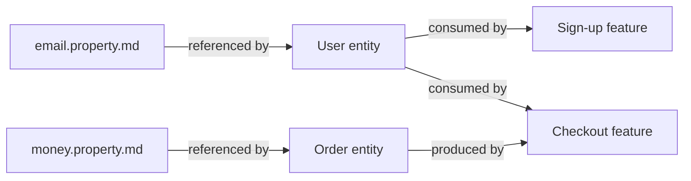

# Feature: Entity

> [SpecScore.**Studio**](https://specscore.studio): | [Explore](https://specscore.studio/app/github.com/specscore/specscore/spec/features/entity?op=explore) | [Edit](https://specscore.studio/app/github.com/specscore/specscore/spec/features/entity?op=edit) | [Ask question](https://specscore.studio/app/github.com/specscore/specscore/spec/features/entity?op=ask) | [Request change](https://specscore.studio/app/github.com/specscore/specscore/spec/features/entity?op=request-change) |

**Status:** Approved
**Source Ideas:** entity-and-property-definitions

## Summary

An entity is a typed, machine-readable definition of a business object — a `User`, an `Order`, a `Money` value object — that one or more SpecScore [features](../feature/README.md) consume or produce. Entities live as single markdown files at `spec/features/**/<slug>.entity.md`, with YAML frontmatter as the **source of truth** for the singular/plural noun, optional inheritance, and the full structured `properties` list (including nested checks and embedded JSON Schemas).

An entity's body has three sections: a hand-written `## Description`, a machine-rendered `## Properties` table (managed view over the frontmatter), and a machine-maintained `## Referenced by` (back-references to features and descendant entities). Properties are either inlined inside the entity's frontmatter or referenced from a standalone [Property](../property/README.md) file by URL or relative path.

## Problem

SpecScore features today reference business data in prose: a sign-up feature mentions "users" and "emails"; an orders feature mentions "orders" and "line items"; nothing links these mentions, validates them, or lets a reviewer answer "which features touch `User`?" Without a typed entity layer, specs cannot be strongly typed, cross-feature data flow is invisible, and downstream tooling (validators, code generators, datatug.io UI, third-party surfaces over the spec graph) has no canonical shape to consume.

The Entity feature fills that gap: a typed, lintable, frontmatter-as-source-of-truth artifact that defines a business object once, lets every feature reference it, and exposes a machine-queryable graph from `specscore entity refs <id>`. Combined with the [Property](../property/README.md) feature for reusable fields, entities give SpecScore the data-modelling vocabulary that prose features alone cannot provide.

## Design Philosophy

Entities are the **business-object layer** — the noun-shaped artifact that features verb upon:

| Layer | Granularity | Example |
|---|---|---|
| Property | Single field | `email` — string, RFC 5322, ≤320 chars |
| **Entity** | **Bag of fields (a business object)** | **`User` — has `id`, `email`, `name`, `created_at`** |
| Feature | Behavior over data | Sign-up consumes `User`; emits `User` |

Entities are the **what-the-system-knows-about** layer; features are the **what-the-system-does-with-it** layer. The two graphs cross-link through entity references in feature READMEs (a forthcoming, separate Idea) and through the `## Referenced by` section maintained on every entity file.



Key tenets:

- **Frontmatter is the source of truth.** The `properties` list lives in YAML, not in a Markdown table. The `## Properties` body table is a managed view that `specscore lint --fix` renders from frontmatter — never a second source. This is a deliberate departure from prose-heavy Doc-Kinds, so every YAML parser in every language can consume the definition directly.
- **Inheritance is additive only in MVP.** A child entity that declares `inherits:` carries every parent property and MAY append new ones. Redefining, tightening, or removing a parent property is a lint error. Override semantics are a tar pit; defer until real reuse patterns demand them.
- **Instances live anywhere under `spec/features/**`.** No central `spec/entities/` directory is mandated. Co-locate the entity with the feature or module that owns it; cross-cutting entities live wherever the consumer's convention places them.
- **Stable IDs, mutable content.** The slug is a contract; the frontmatter and body are revised in place. Renaming an entity requires a successor file with a new slug.

## Behavior

### Entity location

Entity artifacts live as single markdown files anywhere under `spec/features/**`:

```text
spec/features/
  user/
    README.md
    user.entity.md            <- feature-owned entity
  shared/
    money.entity.md           <- cross-cutting entity
    address.entity.md
  order/
    README.md
    order.entity.md
    line-item.entity.md       <- sibling entity in the same feature
```

There is no mandated central directory. Co-locate entities with the feature or module that owns them. The placement convention for cross-cutting entities (e.g., `Money`, `Address`) is left to consumer projects in MVP — typical patterns are `spec/features/shared/`, a domain-scoped feature like `spec/features/finance/`, or the root of `spec/features/`.

#### REQ: entity-location

Every entity artifact MUST reside at a path matching the glob `spec/features/**/*.entity.md`. Entity files elsewhere — for example `spec/entities/`, `docs/`, or anywhere outside `spec/features/` — are a validation error.

#### REQ: slug-format

Entity slugs MUST be lowercase, hyphen-separated, and URL-safe (matching the same pattern as Feature, Idea, and Property slugs). The slug is the filename stem (everything before `.entity.md`) and is the entity's canonical id.

Examples of valid slugs: `user`, `order`, `line-item`, `iso-currency-code`.

#### REQ: single-file

An entity MUST be a single markdown file. Creating a directory at `<slug>.entity/` is a validation error.

### Frontmatter as source of truth

Every entity file leads with a YAML frontmatter block. The frontmatter is the **only** source of structured truth — lint, code generators, the `## Properties` body-table renderer, and any downstream tool consume the frontmatter directly without parsing prose.

```yaml
---
kind: entity
id: user
singular: User
plural: Users
description: A registered human (or service) account in the system.
properties:
  - name: id
    data_type: integer
    description: Primary key. Auto-assigned at creation.
    checks:
      required: true
      min: 1
  - name: email
    ref: ../shared/email.property.md
  - name: display_name
    data_type: string
    checks:
      required: true
      max_length: 80
      trim: true
  - name: created_at
    data_type: datetime
    checks:
      required: true
---
```

#### REQ: frontmatter-required

Every entity file MUST begin with a YAML frontmatter block delimited by `---` lines as the very first non-empty content of the file. An entity file with no frontmatter, or with frontmatter that is not the first block, is a validation error.

#### REQ: frontmatter-required-fields

The frontmatter MUST include, at minimum, these top-level keys:

| Key | Type | Meaning |
|---|---|---|
| `kind` | string | MUST be the literal `entity`. Disambiguates the file from `kind: property` files. |
| `id` | string | MUST equal the file's slug (filename without `.entity.md`). |
| `singular` | string | The singular noun for one instance (e.g., `User`, `Order`). Used in generated docs and tooling. |
| `plural` | string | The plural form (e.g., `Users`, `Orders`). |
| `properties` | sequence | An ordered list of property definitions. MAY be empty (`properties: []`) but the key MUST be present. |

The `description` and `inherits` keys are OPTIONAL. Additional keys MUST NOT be a lint error in MVP (forward-compatibility) but lint MAY emit a warning for unrecognised keys.

#### REQ: id-equals-slug

The frontmatter `id` MUST equal the file's slug (filename without the `.entity.md` suffix). A mismatch is a lint error; `specscore lint --fix` MUST repair it by rewriting `id` to match the filename — the filename is authoritative because renaming a file is more visible than editing frontmatter.

#### REQ: properties-list-shape

Each item in the `properties` list MUST be either an **inline definition** (name plus `data_type` plus `checks`) or a **reference** (name plus `ref:`). The two forms produce the same resolved property shape:

```yaml
properties:
  # Inline definition — shape lives in this entity only.
  - name: display_name
    data_type: string
    checks:
      required: true
      max_length: 80

  # Reference — shape lives in a standalone Property file; this entity
  # carries only the reference. The Property file's `## Referenced by`
  # section is back-populated from this link.
  - name: email
    ref: ../shared/email.property.md
```

The `name` key is REQUIRED for every property item. Every property item in a single entity MUST have a unique `name` — duplicate names are a lint error.

Inline items MUST follow the same `data_type` and `checks` vocabulary defined in the [Property feature](../property/README.md#req-data-type-values).

#### REQ: ref-target-exists

When a property item declares `ref:`, the value MUST resolve to an existing `*.property.md` file. The reference MAY be either a relative path from the entity file (e.g., `../shared/email.property.md`) or a bare URL of the form `https://specscore.md/...` (when cross-repo imports land). A broken reference is a lint error.

#### REQ: inherits-additive-only

The optional `inherits` key carries an id-or-path reference to a parent entity. A child entity that declares `inherits:` automatically carries every property of its parent — the parent's `properties` list is logically prepended to the child's, in order.

The child MAY append new properties. The child MUST NOT redefine, override, or remove any property declared in the parent. Concretely:

- A `name` that appears in both the parent and the child's own `properties` list is a lint error.
- A `name` that the parent declares but the child does not is fine — the child inherits it unchanged.
- A `name` that only the child declares is appended after the parent's properties.

This is **additive-only inheritance**. Override semantics (which checks compose, which replace, transitive override behavior) are explicitly out of MVP — see the source Idea's *Not Doing* list.

#### REQ: inherits-target-exists

When `inherits` is set, the value MUST resolve to an existing `*.entity.md` file. The reference MAY be either a relative path or a bare URL. A broken reference is a lint error.

#### REQ: inherits-acyclic

Inheritance chains MUST be acyclic. A cycle (`A inherits B inherits A`, or any longer loop) is a lint error. Lint MUST detect cycles and terminate safely rather than recurse.

### Body structure

Below the frontmatter, every entity file has exactly three body sections in this order:

```markdown
---
kind: entity
id: user
…
---

# Entity: User

## Description

A registered human (or service) account in the system. Identified by an
integer primary key and a unique normalised email. Display names are
free-form but trimmed and capped at 80 characters; the email field is
defined once in the shared property catalogue and referenced from every
entity that needs it.

## Properties

<!-- managed-by: specscore lint --fix -->
| Name | Type | Required | Description |
|------|------|----------|-------------|
| `id` | integer | yes | Primary key. Auto-assigned at creation. |
| `email` | string *(via [email](../shared/email.property.md))* | yes | An RFC 5322 email address used for authentication and outbound mail. |
| `display_name` | string | yes | — |
| `created_at` | datetime | yes | — |
<!-- end-managed -->

## Referenced by

<!-- managed-by: specscore lint --fix -->
- Feature: [authentication](../authentication/README.md)
- Feature: [billing](../billing/README.md)
- Entity: [admin-user](admin-user.entity.md) *(inherits)*
<!-- end-managed -->

---
*This document follows the https://specscore.md/entity-specification*
```

#### REQ: title-format

The title MUST take the form `# Entity: <singular>` where `<singular>` matches the frontmatter `singular`. A mismatch is a lint error; `specscore lint --fix` MUST repair it from the frontmatter.

#### REQ: required-sections

An entity file MUST include these body sections, in this order:

| Section | Required | Notes |
|---|---|---|
| Title (`# Entity: <singular>`) | Yes | See [REQ: title-format](#req-title-format). |
| `## Description` | Yes | Hand-written prose. MAY be empty; an empty section MUST contain the placeholder `Not described yet.` to keep lint deterministic. |
| `## Properties` | Yes | Machine-rendered managed table. See [REQ: properties-table-managed](#req-properties-table-managed). |
| `## Referenced by` | Yes | Machine-maintained. See [REQ: referenced-by-managed](#req-referenced-by-managed). |
| Adherence footer | Yes | See [REQ: adherence-footer](#req-adherence-footer). |

Additional sections MUST NOT appear in MVP. The narrow body shape keeps consumers simple; if real usage demands more, a future revision will add specific sections rather than admitting arbitrary content.

#### REQ: properties-table-managed

The `## Properties` body section is a managed **view** rendered from the frontmatter `properties` list, never a second source of truth. Its body MUST be wrapped in the canonical `<!-- managed-by: specscore lint --fix -->` / `<!-- end-managed -->` markers. `specscore lint --fix` MUST rewrite the table in place from the frontmatter on every run.

The rendered table MUST have the columns `Name`, `Type`, `Required`, `Description`, in that order. Rows MUST appear in the order they appear in the frontmatter `properties` list, with inherited properties (when `inherits` is set) listed first, in the parent's order. When a property is referenced via `ref:`, the `Type` cell MUST cite the referenced Property file (e.g., `string *(via [email](../shared/email.property.md))*`). Inline properties cite the `data_type` literally.

Hand-edits inside the managed body are a lint error; the table reflects the frontmatter, not human writing.

#### REQ: referenced-by-managed

The `## Referenced by` section is a managed view, never hand-edited. Its body MUST be wrapped in the canonical managed-section markers. `specscore lint --fix` MUST rewrite the section's body in place from a fresh scan of:

1. Every other `*.entity.md` file whose `inherits` references this entity (rendered as `- Entity: <id> *(inherits)*`).
2. Every feature whose README explicitly references this entity — exact reference mechanism (e.g., a forthcoming `**Consumes:**` / `**Produces:**` header field) is a separate Idea and is **out of scope** for this Feature. Until that mechanism lands, this category is empty for most repos; the managed body still renders the section so the back-reference slot is reserved.

When no consumers exist, the managed body MUST be the single line `- _No references yet._` — never empty. Hand-edits inside the managed markers are a lint error.

#### REQ: adherence-footer

Every entity document MUST end with an adherence footer per the [Adherence Footer feature](../adherence-footer/README.md). The footer URL MUST be `https://specscore.md/entity-specification`.

### Tooling Support

SpecScore entities are queryable programmatically by the `specscore` CLI and any spec-aware tool. The Feature spec defines the surface; implementation lives in [`specscore/specscore-cli`](https://github.com/specscore/specscore-cli).

The MVP surface is:

- `specscore entity list` — flat listing of every entity id.
- `specscore entity refs <id>` — every consumer of the entity (other entities via `inherits`, plus features once the consumes/produces mechanism lands).
- `specscore entity tree` — hierarchical view of inheritance chains.
- `specscore property list`, `specscore property refs <id>` — see the [Property feature](../property/README.md).
- `specscore feature refs` — extended to surface entity links from feature READMEs once the consumes/produces mechanism lands.

Additional verbs (`validate`, `diff`, `graph`) are deferred until real usage requests them.

## Interaction with Other Features

| Feature | Interaction |
|---|---|
| [Property](../property/README.md) | Entities reference Properties from their frontmatter `properties` list via `ref:`. Each Property file's `## Referenced by` section is back-populated from those references. Inline property definitions inside an entity use the same `data_type` and `checks` vocabulary as standalone Property files. |
| [Document Types Registry](../document-types-registry/README.md) | The registry carries an `entity` row with `Kind: Document`, `URL: https://specscore.md/entity-specification`, and `Consumer Path: spec/features/**/*.entity.md`. The registry's `Consumer Path` column is relaxed in this Idea to support multiple globs per Kind — see the registry's amended spec. |
| [Adherence Footer](../adherence-footer/README.md) | Entity files end with the adherence footer per the shared mechanism. The URL is `https://specscore.md/entity-specification`. |
| [Feature](../feature/README.md) | Entity is a Document-Kind feature defined at the top of the `spec/features/` tree, following the standard Feature schema. The Consumer Path lives under `spec/features/**` rather than a dedicated `spec/entities/` directory — entities are owned by features and modules, not a global namespace. |
| [Idea](../idea/README.md) | This Feature's `**Source Ideas:**` lists `entity-and-property-definitions`. The Idea names several follow-on Ideas (recordset, override semantics, cross-repo `@import`, feature-level `consumes`/`produces`, i18n) that are explicitly deferred from MVP. |

## Dependencies

- adherence-footer
- document-types-registry
- feature
- property

## Acceptance Criteria

### AC: location-and-naming

**Requirements:** entity#req:entity-location, entity#req:slug-format, entity#req:single-file

An entity file lives at a path matching `spec/features/**/*.entity.md`, has a lowercase-hyphenated slug, and is a single file (not a directory). Any violation is rejected by `specscore lint`.

### AC: frontmatter-shape

**Requirements:** entity#req:frontmatter-required, entity#req:frontmatter-required-fields, entity#req:id-equals-slug, entity#req:properties-list-shape, entity#req:ref-target-exists

Every entity file leads with a YAML frontmatter block carrying `kind: entity`, `id` matching the slug, `singular`, `plural`, and a `properties` list whose items are either inline (`name` + `data_type` + `checks`) or references (`name` + `ref:`). Duplicate property names, broken refs, and `id ≠ slug` are rejected; `id ≠ slug` is auto-fixable from the filename.

### AC: inheritance-additive-only

**Requirements:** entity#req:inherits-additive-only, entity#req:inherits-target-exists, entity#req:inherits-acyclic

A child entity that declares `inherits:` automatically carries every property of its parent. Redefining or removing a parent property is rejected; appending new properties is permitted. Broken `inherits` references and cycles in the inheritance graph are hard lint errors.

### AC: body-shape

**Requirements:** entity#req:title-format, entity#req:required-sections

An entity file's body has a `# Entity: <singular>` title matching the frontmatter `singular`, a `## Description` section (with placeholder text when empty), a managed `## Properties` table, and a managed `## Referenced by` section, in that order. Additional sections are rejected.

### AC: managed-sections-rendered

**Requirements:** entity#req:properties-table-managed, entity#req:referenced-by-managed

The `## Properties` table and the `## Referenced by` section are both wrapped in canonical managed-section markers and rewritten by `specscore lint --fix` from the frontmatter and a fresh repo scan respectively. Hand-edits inside the managed markers are rejected. When no consumers exist, the `## Referenced by` body reads `- _No references yet._`.

This AC defines an explicit MVP exit criterion for the back-reference scan: in MVP, the only back-reference source that is wired up is **other entities' `inherits:`** fields. The feature → entity back-reference source (a forthcoming `**Consumes:**` / `**Produces:**` declaration on Feature READMEs) is deferred to a separate Idea. Until that mechanism lands, an entity that has zero `inherits:`-descendants MUST render `- _No references yet._` inside the managed markers — the absence of a not-yet-shipped feature-link source does NOT block the AC from passing, and lint MUST NOT emit a warning attributable to that absence.

### AC: adherence-footer-present

**Requirements:** entity#req:adherence-footer

Every entity file ends with the adherence footer pointing to `https://specscore.md/entity-specification`. Missing or wrong-URL footers are rejected by `specscore lint`.

## Open Questions

- **Property reference key** — `ref:`, `$ref:`, or `import:`? MVP uses `ref:` because it is the shortest and reads cleanly inside a property item. Lock in or revise during plan-writing.
- **Where do cross-cutting entities live by convention?** The Idea names three plausible options (root `spec/features/`, a `shared/` feature directory, a domain-scoped feature). MVP picks none — convention will emerge from real usage and a follow-on Idea may formalise it.
- **Final naming for the Doc-Kind.** `entity` is the working term and reads cleanly, but is overloaded (DDD, ORM, ER-modelling). Alternatives to evaluate before this feature reaches `Stable`: `model`, `domain-object`, `business-object`. Locked as `entity` in MVP unless a strong objection surfaces during review.
- **Soft lint warning when entity frontmatter exceeds N lines** (e.g., 150 or 200) as a readability guard? Open to keep, drop, or defer to a follow-on Idea.
- **Live inheritance vs snapshot.** MVP position: child entities always reflect the current parent (live inheritance). Confirm during plan-writing; the alternative (pin-to-snapshot) requires an extra `inherits_at:` field and is significantly more complex.
- **Should `## Description` allow Markdown beyond plain prose** (tables, sub-headings, code blocks), or stay narrow? Narrow keeps the section parseable for downstream tooling that wants a one-shot summary; permissive keeps authors unfrustrated.
- **Acceptance criteria not yet covering `## Properties` row order** — should there be an AC that pins the rendered row order to frontmatter order (already a REQ) with a scenario? Decide during plan-writing.

---
*This document follows the https://specscore.md/feature-specification*
