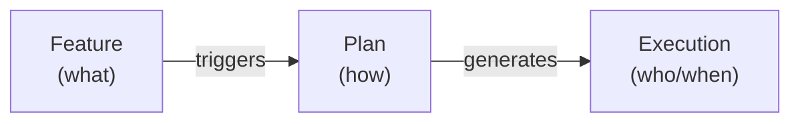
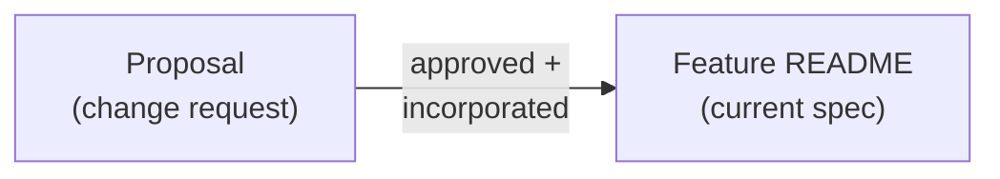
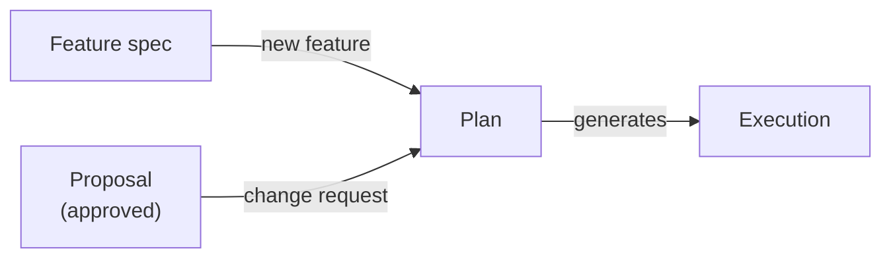

# Feature: Feature

> [SpecScore.**Studio**](https://specscore.studio): | [Explore](https://specscore.studio/app/github.com/specscore/specscore/spec/features/feature?op=explore) | [Edit](https://specscore.studio/app/github.com/specscore/specscore/spec/features/feature?op=edit) | [Ask question](https://specscore.studio/app/github.com/specscore/specscore/spec/features/feature?op=ask) | [Request change](https://specscore.studio/app/github.com/specscore/specscore/spec/features/feature?op=request-change) |

**Status:** Stable
**Grade:** B

## Summary

A feature is the atomic unit of product specification in SpecScore. It describes a capability the product should have — what it does, why it matters, and how it behaves. Features live in the spec repository under `spec/features/` as directories with a mandatory `README.md`. They can nest (sub-features), accept change requests via [proposals](../proposals/README.md), trigger [plans](../plan/README.md), and drive execution through task management tools.

This specification defines the structure, metadata, lifecycle, and conventions that every feature must follow. The typed shape of a single Feature is captured in the co-located [feature entity](feature.entity.md).

## Problem

Projects that use structured specifications often have implicit conventions — scattered across contributor guides, root README files, and learned by example. There is no single document that answers:

- What must a feature directory contain?
- What metadata does a feature carry?
- What is a feature's lifecycle?
- How do features relate to plans, proposals, and tasks?

Without a formal definition, new features are created inconsistently, AI agents cannot reliably navigate the feature tree, and validation tools have nothing to validate against.

## Design Philosophy

Features are the **"what"** layer of a specification. They describe desired product behavior — not how to build it (that is the [plan](../plan/README.md)'s job) and not who is building it right now (that is execution/task management's job).



Features are **living documents**. Plans are also mutable, but use snapshots to capture immutable reference points (approval, checkpoints, completion). A feature spec evolves as proposals are accepted and incorporated. The feature README always reflects the current desired behavior — not a historical snapshot.

## Behavior

### Feature location

Features live under `spec/features/` in the spec repository:

```
spec/features/
  README.md                     <- feature index
  {feature-slug}/
    README.md                   <- feature specification
    _tests/                     <- test scenarios (optional)
      {scenario-slug}.md
      flows/
    proposals/                  <- change requests (optional)
      README.md
      {proposal-slug}/
        README.md
    {sub-feature-slug}/         <- sub-feature (optional)
      README.md
```

#### REQ: directory-readme

Every feature directory MUST contain a `README.md` file. This file is the feature specification — the single source of truth for what the feature does and how it behaves.

#### REQ: slug-format

Feature slugs MUST be lowercase, hyphen-separated, and URL-safe. Underscores, spaces, and special characters are not permitted.

Examples of valid slugs: `claim-and-push`, `model-selection`, `ui`, `source-references`.

### Reserved `_` prefix convention

Directories prefixed with `_` are reserved for SpecScore tooling and extensions:

| Directory | Purpose | Spec |
|---|---|---|
| `_args/` | Argument documentation | Extension point for CLI tooling |
| `_tests/` | Feature-scoped test scenarios | [Scenario](../scenario/README.md) |

#### REQ: underscore-reserved

Directories prefixed with `_` are NOT sub-features. They MUST be excluded from the feature index and Contents table.

### Feature README structure

Every feature README follows this template:

```markdown
# Feature: {Title}

**Status:** {status}
**Source Ideas:** — *(optional; comma-separated Idea slugs — see [Idea linkage](#idea-linkage))*

## Summary

One to three sentences describing the feature's purpose.

## Contents

(Only if the feature has sub-features or child directories)

| Directory   | Description                     |
|-------------|---------------------------------|
| [child/](child/README.md) | Brief description of the child |

### child

1-7 sentence summary of each child directory.

## Problem

Why this feature exists. What gap or pain point it addresses.

## Behavior

How the feature works. The bulk of the spec — structure, rules,
examples, edge cases. Topics use ### headings; individual rules
use `#### REQ: {slug}` under their topic.
See [Requirement](../requirement/README.md).

## Interaction with Other Features

(Optional) How this feature relates to other features.

## Dependencies

- feature-slug-1
- feature-slug-2

(Or omit the section entirely if the feature is independent.)

## Acceptance Criteria

Not defined yet.

(Or: a table of ACs when defined.)

## Open Questions

- Question 1
- Question 2

(Or: "None at this time." — the section is never omitted.)

---
*This document follows the https://specscore.md/feature-specification*
```

#### REQ: title-format

Every feature README title MUST use the `# Feature: {Title}` format. The `Feature:` prefix is required.

#### REQ: status-field

A `**Status:**` field MUST appear immediately after the title. The value MUST be one of: `Draft`, `Under Review`, `Approved`, `Implementing`, `Stable`, `Deprecated`.

#### REQ: required-sections

Every feature README MUST include these sections:

| Section                 | Required    | Notes                                                             |
|-------------------------|-------------|-------------------------------------------------------------------|
| Title (`# Feature: X`) | Yes         | Always prefixed with `Feature:`                                   |
| Status                  | Yes         | Immediately after the title                                       |
| Source Ideas            | Optional    | Body-metadata line after Status. See [Idea linkage](#idea-linkage). |
| Grade                   | Optional    | Body-metadata line, last in the header block. See [Grade](#grade). |
| Summary                 | Yes         | 1-3 sentences                                                     |
| Contents                | Conditional | Required when the feature has child directories                   |
| Problem                 | Yes         | Why the feature exists                                            |
| Behavior                | Yes         | How the feature works                                             |
| Proposals               | Conditional | Present when the feature has a `proposals/` directory             |
| Plans                   | Conditional | Present when a [plan](../plan/README.md) touches this feature |
| Acceptance Criteria     | Yes         | Always present. See [REQ: ac-section](#req-ac-section).           |
| Open Questions          | Yes         | Always present. See [REQ: open-questions](#req-open-questions). |
| Adherence footer        | Yes         | Always the last line. See [REQ: adherence-footer](#req-adherence-footer).     |

#### Optional sections

Features MAY include additional sections as needed:

| Section                         | When to use                                              |
|---------------------------------|----------------------------------------------------------|
| Dependencies                    | When the feature depends on other features. A bullet list of feature IDs. Consumed by spec tooling. Omit if independent. |
| Design Principles               | When the feature has guiding architectural constraints    |
| Interaction with Other Features | When the feature has notable dependencies or touchpoints  |
| Configuration                   | When the feature introduces project settings              |

### Required section behavior

These requirements define how specific required sections behave when they have no content.

#### REQ: open-questions

The Open Questions section MUST always be present in every feature README. If there are no open questions, it MUST explicitly state "None at this time." The section MUST NOT be omitted.

#### REQ: ac-section

The Acceptance Criteria section MUST always be present in every feature README. When no ACs are defined, it MUST state "Not defined yet." and a corresponding Open Question ("Acceptance criteria not yet defined for this feature.") MUST be raised.

#### REQ: adherence-footer

Every feature README MUST end with an adherence footer per the [Adherence Footer feature](../adherence-footer/README.md). The footer URL MUST be `https://specscore.md/feature-specification`.

#### REQ: contents-when-children

When a feature has child directories (sub-features), its README MUST include a Contents section with:

1. An index table listing each child directory with a description
2. A 1-7 sentence summary for each child, giving readers context without requiring them to open each child

### Feature statuses

| Status         | Description                                                                              |
|----------------|------------------------------------------------------------------------------------------|
| `Draft`        | Feature is being authored; design decisions remain open. Not yet ready for review.        |
| `Under Review` | Feature is presented for review (reviewer subagent and/or human reviewer).                |
| `Approved`     | Feature has passed review; user has explicitly approved the spec.                         |
| `Implementing` | Feature spec is approved; code is being written from it. Spec MAY still iterate in place. |
| `Stable`       | Feature is fully specified and implemented; changes go through proposals.                 |
| `Deprecated`   | Feature is being phased out; a successor or removal plan exists.                          |

```mermaid
graph LR
    A["Draft"]
    B["Under Review"]
    C["Approved"]
    D["Implementing"]
    E["Stable"]
    F["Deprecated"]

    A -->|present for review| B
    B -->|approved| C
    A -->|approved (fast path)| C
    C -->|build starts| D
    D -->|spec + impl complete| E
    E -->|superseded or removed| F
```

These statuses describe the feature's **specification maturity** primarily, but `Implementing` and `Stable` also signal implementation phase. A feature can be `Stable` in spec while its implementation is still in development — the spec is the source of truth for desired behavior.

The `Draft → Under Review → Approved → Implementing` quartet aligns with the parallel quartet on [Idea](../idea/README.md) so that the early-and-mid lifecycle vocabulary is consistent across artifact types. Post-`Implementing` states diverge to match each artifact's natural terminal lifecycle (Idea → `Specified` → `Archived`; Feature → `Stable` → `Deprecated`). The shared `Implementing` state means "the work of making this real is in progress" in both contexts: for an Idea, that work includes specifying-then-implementing its Features; for a Feature, that work is writing code from the approved spec.

### Feature nesting and identification

Features can contain sub-features as child directories. Each sub-feature is a full feature with its own `README.md`, status, and lifecycle.

```
spec/features/ui/
  README.md                  <- parent feature
  hub/
    README.md                <- sub-feature
  tui/
    README.md                <- sub-feature
```

#### REQ: path-identification

Features MUST be identified by their path relative to `spec/features/`. This path is the canonical identifier used in plans, source references, and spec tooling.

| Feature path                      | Identifier          |
|-----------------------------------|---------------------|
| `spec/features/authentication/`   | `authentication`    |
| `spec/features/billing/payments/` | `billing/payments`  |
| `spec/features/user-management/`  | `user-management`   |

### Feature index

The feature index (`spec/features/README.md`) is the entry point for understanding the product's planned capabilities. It contains:

1. An **Index** table with columns: Feature, Status, Description
2. A **Feature Summaries** section with a paragraph per feature
3. A **Feature dependency graph** showing relationships
4. An **Open Questions** section

#### REQ: index-completeness

The feature index (`spec/features/README.md`) MUST list every top-level feature. An unlisted feature is a validation error.

### Idea linkage

Features MAY originate from one or more [Ideas](../idea/README.md). When they do, the Feature declares its ancestry with a `**Source Ideas:**` header field listing one or more Idea slugs:

```markdown
**Source Ideas:** payment-fraud-signals, offline-mode
```

The field is optional — many Features are authored directly, without a preceding Idea artifact. When present, its value is either `—` (empty) or a comma-separated list of Idea slugs. The relationship is **many-to-many**: a Feature may synthesize multiple Ideas, and a single Idea may be referenced by multiple Features.

The Feature carries the authoritative link. The reverse index lives on each Idea as a `**Promotes To:**` field, which is managed by tooling — never hand-edited. See the [Idea feature](../idea/README.md) for the Idea side of the contract.

#### REQ: source-ideas-field

A Feature README MAY include a `**Source Ideas:**` body-metadata line. The field is OPTIONAL — a Feature without a source Idea is valid.

When the field is present:

- Its value MUST be either `—` (empty) or a comma-separated list of Idea slugs.
- Every slug MUST resolve to an existing Idea file at `spec/ideas/<slug>.md` or `spec/ideas/archived/<slug>.md`.
- Every referenced Idea MUST have `Status ∈ {Approved, Implementing, Specified}`. Referencing an Idea with `Status` of `Draft`, `Under Review`, or `Archived` is a validation error. `Implementing` is allowed because a Feature being added while an Idea is already mid-flight (other Features exist for it but not all are Stable) is a legitimate workflow.
- The relationship is many-to-many: a Feature MAY list multiple Source Ideas, and the same Idea MAY appear in the `**Source Ideas:**` of multiple Features.

#### REQ: source-ideas-drive-idea-status

Creating or updating a Feature's `**Source Ideas:**` field triggers tooling to reconcile each referenced Idea's `**Promotes To:**` and `**Status:**` (see [Idea#req:specified-derivation](../idea/README.md#req-specified-derivation) and [Idea#req:sync-lint-strict](../idea/README.md#req-sync-lint-strict)). Features declare the reference; `specscore lint --fix` (or the equivalent Feature-creation tooling) reconciles Idea status. Feature authors MUST NOT edit an Idea's `**Promotes To:**` or `**Status:**` directly to reflect a Feature link — the Feature's `**Source Ideas:**` entry is the only authoritative input.

### Grade

A Feature README MAY carry an optional `**Grade:**` body-metadata line recording a single-value quality grade:

```markdown
```

The field is OPTIONAL and holds exactly one value, overwritten on each re-grade — there is no grade history. When present, `**Grade:**` is the **last** line of the header block, after `**Status:**` and any `**Source Ideas:**` / `**Supersedes:**` lines. The set of allowed values is repository-configurable via `grade.values` in `specscore.yaml` (default `A, B, C, D, F`), and `specscore spec lint` validates the value against that set. The field is generic — it is not coupled to any reviewer-gate workflow or to the Feature's `Status` — and applies to every artifact kind that has a header block, not only Features.

The canonical definition, lint behavior, and configuration of this field are owned by the [Grade body-metadata field](../canonical-grade-metadata-field/README.md) Feature; this section documents its appearance on a Feature README.

## Relationship to Other Artifacts

### Features and proposals

[Proposals](../proposals/README.md) are change requests attached to a feature. They live under `{feature}/proposals/` and follow the proposal lifecycle (`draft -> submitted -> approved -> implemented`). A proposal is non-normative until its content is incorporated into the feature's main README.



### Features and plans

[Plans](../plan/README.md) bridge features to execution. A plan is triggered by either a new feature spec or an approved proposal. Plans live separately in `spec/plans/` but reference the features they affect.

Every plan lists its affected features in its header. Each affected feature's README includes a **Plans** section back-referencing active plans.



### Features and execution

Features do not directly reference execution units. The plan bridges specifications to execution.

### Features and open questions

Every feature maintains an [Open Questions](../open-questions/README.md) section. Questions follow the standard question lifecycle defined by the Open Questions feature.

## Tooling Support

SpecScore features can be queried programmatically by spec-aware tools:

- **Feature info** — Retrieve structured metadata (status, parent, children, dependency counts) plus section table-of-contents with line ranges.
- **Feature list** — Flat listing of all feature IDs.
- **Feature tree** — Hierarchical view with optional focus and direction.
- **Feature deps/refs** — Dependency and reverse-dependency traversal.

For Synchestra integration, see [synchestra.io](https://synchestra.io) CLI documentation.

## Configuration

Feature behavior is configured through the repo config file. See [Repo Config](../repo-config/README.md) for available settings.

## Interaction with Other Features

| Feature | Interaction |
|---------|-------------|
| [Idea](../idea/README.md) | Features MAY declare one or more source Ideas via the `**Source Ideas:**` header field. The relationship is many-to-many. Tooling uses this link to derive each Idea's `**Promotes To:**` and `**Status:**`; Features do not manage Idea state directly. |
| [Proposals](../proposals/README.md) | Proposals attach change requests to features. Features display recent proposals in their README. |
| [Plan](../plan/README.md) | Plans reference features they affect. Features back-reference active plans. |
| [Requirement](../requirement/README.md) | Requirements are `#### REQ:` subsections under topic headings within a feature's Behavior section. They are the addressable rules that scenarios verify. |
| [Acceptance Criteria](../acceptance-criteria/README.md) | ACs are optional `### AC:` sections in the Acceptance Criteria section that bundle related requirements into composite verification conditions. |
| [Scenario](../scenario/README.md) | Scenarios are concrete behavior examples in the feature's `_tests/` directory. They validate REQs or ACs with Given/When/Then flows. |
| [Open Questions](../open-questions/README.md) | Every feature maintains an Open Questions section with the standard question lifecycle. |

For tool integrations (CLI, UI, API, LSP), see [Synchestra](https://synchestra.io).

## Acceptance Criteria

### AC: readme-structure

**Requirements:** feature#req:title-format, feature#req:status-field, feature#req:required-sections

A feature README has a correctly formatted title (`# Feature: {Title}`), a valid status field immediately after the title, and all required sections present. A README that violates any of these is rejected by validation.

### AC: adherence-footer-present

**Requirements:** feature#req:adherence-footer

Every feature README ends with an adherence footer whose link target is `https://specscore.md/feature-specification` (trailing slash optional). A README missing the footer or pointing to a different URL is rejected by `specscore lint`.

### AC: empty-state-text

**Requirements:** feature#req:open-questions, feature#req:ac-section

Sections with no content use their prescribed placeholder text. Open Questions says "None at this time." when empty. Acceptance Criteria says "Not defined yet." when undefined, and a corresponding Open Question is raised.

### AC: source-ideas-linkage

**Requirements:** feature#req:source-ideas-field, feature#req:source-ideas-drive-idea-status

A Feature MAY declare zero or more source Ideas via a `**Source Ideas:**` header field. Every listed slug resolves to an existing Idea with `Status ∈ {Approved, Implementing, Specified}`; any other target (missing file, `Draft`, `Under Review`, or `Archived`) is rejected by lint. Adding or removing a slug triggers tooling to reconcile the referenced Idea's `**Promotes To:**` and `**Status:**` — Features never mutate Idea state directly.

## Open Questions

- Should features have a machine-readable metadata format (YAML frontmatter) in addition to the markdown convention (`**Status:** X`), or is the markdown convention sufficient for both humans and parsers?
- Should sub-feature status roll up to the parent? (e.g., if all sub-features are `Stable`, is the parent automatically `Stable`?)
- How should features handle versioning? When a feature undergoes a major redesign, should the old spec be archived or superseded in place?

---
*This document follows the https://specscore.md/feature-specification*
