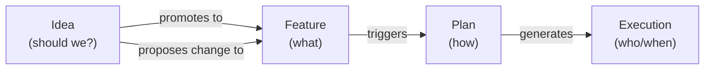
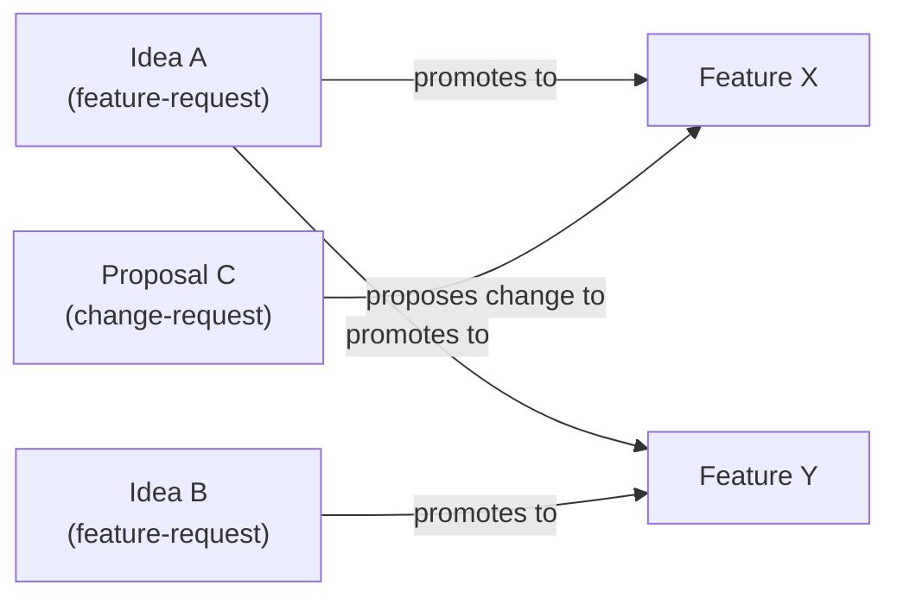

# Feature: Idea

> [SpecScore.**Studio**](https://specscore.studio): | [Explore](https://specscore.studio/app/github.com/specscore/specscore/spec/features/idea?op=explore) | [Edit](https://specscore.studio/app/github.com/specscore/specscore/spec/features/idea?op=edit) | [Ask question](https://specscore.studio/app/github.com/specscore/specscore/spec/features/idea?op=ask) | [Request change](https://specscore.studio/app/github.com/specscore/specscore/spec/features/idea?op=request-change) |

**Status:** Approved

## Summary

An idea is a **pre-spec, lintable one-pager** that captures a problem, a recommended direction, an MVP scope, and the assumptions that must hold for the direction to be worth pursuing. Ideas are the optional front-door to SpecScore: they refine a vague concept into something concrete enough to promote into one or more [Features](../feature/README.md).

Ideas come in two types: **feature-request ideas** (the default — greenfield new capabilities) and **change-request ideas** (proposals that target an existing Feature for mutation). Change-request ideas are also called **proposals** and live co-located with their target Feature at `{feature}/proposals/<slug>.md`. Both types share the same schema and lifecycle.

An idea artifact is a single file at `spec/ideas/<slug>.md` (feature-request) or `spec/features/<feature>/proposals/<slug>.md` (change-request) with typed YAML front-matter and a fixed section schema. Ideas can be authored manually, by AI agents, or — recommended — via the [`specstudio:ideate`](https://github.com/specscore/specstudio-skills) skill. The spec defines the artifact; it does not mandate the authoring workflow. The typed shape of a single Idea is captured in the co-located [idea entity](idea.entity.md).

## Problem

Projects accumulate raw concepts — half-formed features, user complaints, "what if we…" sketches — long before anyone is ready to write a Feature spec. Today that material lives in chat logs, scratch docs, or `docs/ideas/` directories that no tool can read. This creates three problems:

- **No review gate before design.** Teams jump from vague idea to feature design without stress-testing alternatives or naming dealbreaker assumptions. Bad directions survive into plans and code.
- **No traceable lineage.** When a shipped Feature turns out to rest on a bad assumption, there is no earlier artifact to point at. The assumption is implicit, and the retrospective has nothing to audit.
- **No machine-addressable pre-spec layer.** Tools that want to reason about the product pipeline (Synchestra, Rehearse, dashboards) can see Features and Plans but have no typed representation of the upstream thinking.

Additionally, there is no formal mechanism for proposing changes to existing Features. Change requests are described informally in issue trackers and chat but have no structured artifact, no lifecycle, and no discoverable index on the Feature they target.

The Idea feature fills both gaps: a typed, lintable artifact for the "is this worth building?" conversation (feature-request ideas) and the "should we change this?" conversation (change-request ideas / proposals), with a unified promotion path.

## Design Philosophy

Ideas are the **"should we?"** layer. Features describe desired behavior; Plans describe how to build it; Ideas describe whether the direction is worth committing to.



Key tenets inherited from the SDD skill family:

- **Unsaved ideation is waste.** If a direction is worth discussing, it is worth a lint-clean artifact.
- **Say no to 1,000 things.** The `Not Doing` section is load-bearing — an Idea without explicit exclusions is not an Idea.
- **Types beat vibes.** An Idea that cannot pass `specscore lint` is not ready to be promoted.
- **Stable IDs, mutable content.** The slug is a contract; the body is revised in place until the Idea reaches Implemented or is Archived.
- **One entity, two roles.** A proposal (also called a change request) is an Idea with a target, not a separate artifact type. One schema, one lifecycle, one CLI, one index.

Ideas are **living until implemented**. Once `Status: Implemented`, the artifact is effectively frozen — further changes belong in the downstream Features, not in the Idea. While an Idea is `Implementing`, it MAY still be revised in place, since the work it describes is still in motion.

## Behavior

### Idea location

Ideas live as single files. Feature-request ideas reside under `spec/ideas/`; change-request ideas reside under their target Feature's `proposals/` directory:

```text
spec/ideas/
  README.md              <- idea index (active + archived, all types)
  <slug>.md              <- a feature-request idea
  <another-slug>.md
  archived/
    README.md            <- archived idea index
    <old-slug>.md        <- an archived idea (Status: Archived)

spec/features/<feature-slug>/
  README.md              <- the Feature spec
  proposals/
    <slug>.md            <- a change-request idea (proposal) targeting this Feature
```

Unlike Features and Plans, Ideas are **files, not directories**. An Idea has no sub-artifacts and no `_tests/`. Supporting material (mockups, research notes) belongs either on the downstream Feature (once promoted) or in `docs/`.

#### REQ: idea-location

Every feature-request Idea artifact MUST reside at `spec/ideas/<slug>.md` (active) or `spec/ideas/archived/<slug>.md` (archived). Every change-request Idea MUST reside at `spec/features/<feature-slug>/proposals/<slug>.md` where `<feature-slug>` matches the value of the Idea's `**Targets:**` field. Ideas at any other location are rejected by validation.

#### REQ: slug-format

Idea slugs MUST be lowercase, hyphen-separated, and URL-safe (matching the same pattern as Feature slugs). The slug is the stable ID; once created, it MUST NOT be renamed. A scope change that invalidates the current slug requires a successor Idea with a new slug and a `supersedes:` link.

Examples of valid slugs: `payment-fraud-signals`, `offline-mode`, `team-billing`.

#### REQ: single-file

An Idea MUST be a single markdown file. Creating a directory at `spec/ideas/<slug>/` or `spec/features/<feature>/proposals/<slug>/` is a validation error.

### Idea types

Ideas have an optional `**Type:**` field that determines whether they are greenfield (feature-request) or targeted (change-request / proposal).

#### REQ: type-field

The `**Type:**` field, when present, MUST be one of: `feature-request`, `change-request`. Any other value is a validation error.

#### REQ: type-default

When the `**Type:**` field is absent or set to `—`, the Idea is treated as `feature-request`. Tooling MUST NOT require the field to be present on feature-request Ideas.

#### REQ: targets-required

An Idea with `**Type:** change-request` MUST include a `**Targets:**` field with a non-empty value (a Feature slug). An Idea with Type `feature-request` (or absent Type) MUST NOT have a `**Targets:**` field with a value other than `—`.

#### REQ: targets-valid-feature

The `**Targets:**` value MUST reference an existing Feature directory under `spec/features/`. A broken reference is a validation error.

#### REQ: change-request-location

An Idea with `**Type:** change-request` and `**Targets:** <feature-slug>` MUST reside at `spec/features/<feature-slug>/proposals/<slug>.md`. A change-request Idea at any other location is a validation error. The `proposals/` directory is created on demand when the first change-request Idea targeting a Feature is scaffolded.

#### REQ: proposal-title-prefix

An Idea with `**Type:** change-request` MUST use the title prefix `# Proposal: <Title>`. An Idea with Type `feature-request` (or absent Type) MUST use the title prefix `# Idea: <Title>`. The title prefix is the dispatch key for lint: `# Proposal:` triggers idea validation with the additional requirement that `Type: change-request` and `Targets:` are present and valid.

#### REQ: proposal-merge-on-implementation

A change-request Idea's content MUST NOT be merged into the target Feature's README until the implementation lands. The Feature README reflects **current behavior** — it is the source of truth for "what exists." The change-request Idea is the source of truth for "what we want to change" until the change is implemented. When the implementation is complete:

1. The Feature README is updated in the same PR (or commit) that lands the implementation, incorporating the behavioral changes described by the proposal.
2. The change-request Idea transitions to `Status: Implemented`.
3. The proposal file remains at `{feature}/proposals/<slug>.md` as historical record.

A Feature at `Status: Stable` MUST NOT have its README updated with unimplemented proposal content. The `## Proposals` index section on the Feature README surfaces pending change-request Ideas so readers can see what changes are planned without the Feature README containing speculative content.

#### REQ: phase-field

An Idea MAY include an optional `**Phase:**` field with a free-form string value (e.g. `2`, `post-launch`, `foundation`). The field is intended for change-request Ideas that constitute ordered phases of a multi-phase Feature delivery, but is not restricted by Type — any Idea MAY carry it. When present, the value MUST be a non-empty string. Lint does not validate ordering across Phase values; UI and index tooling sort phases in the order they appear in the auto-generated `## Proposals` section on the Feature README (definition order).

### Idea header fields

Ideas use the **same markdown-body metadata convention as Features** — no YAML front-matter. Metadata fields appear as bold-prefixed lines immediately after the title:

```markdown
# Idea: <Idea Name>

**Status:** Draft
**Date:** YYYY-MM-DD
**Owner:** <author identifier>
**Promotes To:** — *(managed by tooling; do not edit manually)*
**Supersedes:** — *(optional; slug of an Idea this one replaces)*
**Related Ideas:** — *(optional; typed links to other Ideas — see [Related Ideas](#related-ideas))*
**Archive Reason:** — *(required only when Status is Archived)*
```

Change-request Ideas carry additional fields:

```markdown
# Proposal: <Proposal Name>

**Status:** Draft
**Type:** change-request
**Targets:** <feature-slug>
**Phase:** — *(optional; free-form string for phased delivery)*
**Date:** YYYY-MM-DD
**Owner:** <author identifier>
**Promotes To:** —
**Supersedes:** —
**Related Ideas:** —
**Archive Reason:** —
```

#### REQ: title-format

Every Idea title MUST use either `# Idea: <Title>` or `# Proposal: <Title>`. The prefix is the dispatch key used by `specscore lint` to select the Idea rule set. `# Proposal:` additionally requires `**Type:** change-request` and a valid `**Targets:**` field (see [REQ: proposal-title-prefix](#req-proposal-title-prefix)).

#### REQ: header-fields

Every Idea MUST include `**Status:**`, `**Date:**`, and `**Owner:**` fields immediately after the title. `**Promotes To:**`, `**Supersedes:**`, and `**Related Ideas:**` MUST be present (value `—` when empty). `**Archive Reason:**` is required only when `Status: Archived` (see [REQ: archive-reason](#req-archive-reason)). `**Type:**`, `**Targets:**`, and `**Phase:**` are optional — see [REQ: type-field](#req-type-field), [REQ: targets-required](#req-targets-required), and [REQ: phase-field](#req-phase-field) for when each is required or prohibited. When present, `**Type:**` and `**Targets:**` MUST appear after `**Status:**` and before `**Date:**`; `**Phase:**` MUST appear after `**Targets:**`.

#### REQ: id-is-slug

An Idea's canonical id is its filename without `.md` — the slug itself. There is no separate `id` field.

#### REQ: promotes-to-managed

The `**Promotes To:**` field is **managed state** for feature-request Ideas. Tooling populates it when a Feature is created that references this Idea (see [REQ: feature-cross-reference](#req-feature-cross-reference)). Authors and authoring skills MUST NOT edit it manually. A feature-request Idea with `Status: Specifying`, `Status: Implementing`, or `Status: Implemented` MUST have a non-empty `**Promotes To:**`. For change-request Ideas, `**Promotes To:**` is always `—` — change-request Ideas target existing Features rather than promoting to new ones.

### Idea document structure

Every Idea follows this section schema:

```markdown
# Idea: <Idea Name>

**Status:** <status>
**Date:** YYYY-MM-DD
**Owner:** <author>
**Promotes To:** —
**Supersedes:** —

## Problem Statement
<One "How Might We…" sentence.>

## Context
<Triggering observation, related specs, prior art.>

## Recommended Direction
<2–3 paragraphs: what and why, over the alternatives.>

## Alternatives Considered
<2–3 directions that lost, and why each lost.>

## MVP Scope
<The single job the MVP nails. Timeboxed, not feature-listed.>

## Not Doing (and Why)
- <Thing 1> — <reason>
- <Thing 2> — <reason>
- <Thing 3> — <reason>

## Key Assumptions to Validate
| Tier | Assumption | How to validate |
|------|------------|-----------------|
| Must-be-true | … | … |
| Should-be-true | … | … |
| Might-be-true | … | … |

## SpecScore Integration
- **New Features this would create:** <list or "TBD at design time">
- **Existing Features affected:** <list or "none">
- **Dependencies:** <other Ideas or in-flight work>

## Open Questions
- <Question that needs answering before promotion to Feature(s)>
```

Change-request Ideas (proposals) use the same section schema. The same sections are required regardless of Idea type.

#### REQ: required-sections

An Idea MUST include these sections, in this order:

| Section | Required | Notes |
|---|---|---|
| Title (`# Idea: <Name>` or `# Proposal: <Name>`) | Yes | Prefix required. See [REQ: title-format](#req-title-format). |
| Header fields | Yes | `Status`, `Date`, `Owner`, `Promotes To`, `Supersedes`. See [REQ: header-fields](#req-header-fields). |
| Problem Statement | Yes | Contains exactly one "How Might We…" framing. |
| Context | Yes | May be brief but MUST be present. |
| Recommended Direction | Yes | The direction the author is recommending. |
| Alternatives Considered | Yes | At least two alternatives with reasons they lost. |
| MVP Scope | Yes | Describes the smallest useful release. |
| Not Doing (and Why) | Yes | See [REQ: not-doing-non-empty](#req-not-doing-non-empty). |
| Key Assumptions to Validate | Yes | See [REQ: must-be-true-present](#req-must-be-true-present). |
| SpecScore Integration | Yes | Links the Idea back to the Feature graph. |
| Open Questions | Yes | Empty state: "None at this time." |

#### REQ: not-doing-non-empty

The `Not Doing (and Why)` section MUST contain at least one explicit exclusion with a reason. An Idea with an empty "Not Doing" list is rejected — the absence of explicit scope cuts is treated as insufficient sharpening.

#### REQ: must-be-true-present

The `Key Assumptions to Validate` table MUST list at least one Must-be-true assumption. Must-be-true assumptions are dealbreakers — an Idea without a named dealbreaker has not been stress-tested.

#### REQ: hmw-framing

The `Problem Statement` section SHOULD contain exactly one "How Might We…" sentence. Violations are warnings, not errors — some Ideas legitimately frame problems differently, but the HMW form is the idiomatic shape.

### Idea statuses

| Status | Description |
|---|---|
| `Draft` | First lint-clean write. Author is iterating. |
| `Under Review` | Author has requested feedback from stakeholders. |
| `Approved` | Recommended Direction has been approved; ready for detailed specification. |
| `Specifying` | A detailed specification is being written. For feature-request Ideas, this is derived when a Feature referencing this Idea exists at `Draft` or `Under Review`. For change-request Ideas, this is author-managed (set when detailed AC or a plan is being drafted). |
| `Specified` | Detailed spec/AC/plan exists; work hasn't started. For feature-request Ideas, derived when the referenced Feature reaches `Approved`. For change-request Ideas, author-managed. |
| `Implementing` | Work is in progress. For feature-request Ideas, derived when the referenced Feature reaches `Implementing`. For change-request Ideas, author-managed. |
| `Implemented` | Done. The promoted Feature shipped (feature-request) or the proposed change landed (change-request). The Idea stays visible in default listings and in its current file location — it is not moved or hidden. |
| `Archived` | Idea was abandoned or superseded. Feature-request Ideas are moved to `spec/ideas/archived/<slug>.md`. Archived Ideas are hidden from `specscore idea list` by default (requires `--include-archived`). |

```mermaid
graph LR
    A["Draft"]
    B["Under Review"]
    C["Approved"]
    G["Specifying"]
    H["Specified"]
    D["Implementing"]
    I["Implemented"]
    F["Archived"]

    A -->|request feedback| B
    B -->|approved| C
    A -->|approved (fast path)| C
    C -->|spec started| G
    G -->|spec complete| H
    H -->|work started| D
    D -->|work done| I
    A -->|abandon| F
    B -->|abandon| F
    C -->|abandon| F
    G -->|abandon| F
    H -->|abandon| F
    D -->|abandon| F
```

The `Draft → Under Review → Approved` progression aligns with the parallel progression on [Feature](../feature/README.md) so that early lifecycle vocabulary is consistent across artifact types.

#### REQ: status-values

The `**Status:**` value MUST be one of: `Draft`, `Under Review`, `Approved`, `Specifying`, `Specified`, `Implementing`, `Implemented`, `Archived`. Any other value is a validation error.

#### REQ: specifying-derivation

For feature-request Ideas: `Status: Specifying` MUST be set if and only if at least one Feature in `spec/features/` lists the Idea's slug in its `**Source Ideas:**` field, AND every such referenced Feature has `Status` in {`Draft`, `Under Review`}. The transition is driven by Feature creation, not by the author.

#### REQ: specified-derivation

For feature-request Ideas: `Status: Specified` MUST be set if and only if at least one Feature in `spec/features/` lists the Idea's slug in its `**Source Ideas:**` field, AND every such referenced Feature has `Status: Approved`. A Feature at `Approved` is fully specified but not yet being implemented. The transition is driven by Feature status change, not by the author.

#### REQ: implementing-derivation

For feature-request Ideas: `Status: Implementing` MUST be set if and only if (a) at least one Feature in `spec/features/` lists the Idea's slug in its `**Source Ideas:**` field, AND (b) at least one such referenced Feature has `Status: Implementing`. The transition is driven by Feature status change, not by the author.

#### REQ: implemented-derivation

For feature-request Ideas: `Status: Implemented` MUST be set if and only if (a) at least one Feature in `spec/features/` lists the Idea's slug in its `**Source Ideas:**` field, AND (b) every such referenced Feature has `Status: Stable`. The transition is driven by Feature stabilization, not by the author.

#### REQ: change-request-status-author-managed

For change-request Ideas: statuses `Specifying`, `Specified`, `Implementing`, and `Implemented` are **author-managed** (or set by tooling that detects signals like plan creation or `Verifies:` commit trailers). The derivation rules ([REQ: specifying-derivation](#req-specifying-derivation), [REQ: specified-derivation](#req-specified-derivation), [REQ: implementing-derivation](#req-implementing-derivation), [REQ: implemented-derivation](#req-implemented-derivation)) do NOT apply to change-request Ideas. Lint MUST NOT reject a change-request Idea at these statuses based on Feature reference checks.

#### REQ: derived-status-not-author-set

For feature-request Ideas: an author (human or skill) MUST NOT directly write `**Status:** Specifying`, `**Status:** Specified`, `**Status:** Implementing`, or `**Status:** Implemented`. Attempting to do so produces a lint error unless the corresponding Feature references and Feature statuses match the derivation rules above. This rule does NOT apply to change-request Ideas (see [REQ: change-request-status-author-managed](#req-change-request-status-author-managed)).

#### REQ: implementing-requires-promotion

A feature-request Idea with `Status: Specifying`, `Status: Specified`, `Status: Implementing`, or `Status: Implemented` MUST have a non-empty `**Promotes To:**` list. The transition to these statuses is driven by Feature creation and status changes, not by the author. This rule does NOT apply to change-request Ideas, which always have `**Promotes To:** —`.

#### REQ: archived-location

A feature-request Idea with `Status: Archived` MUST reside at `spec/ideas/archived/<slug>.md`. An Idea file at the top level of `spec/ideas/` with `Status: Archived` is a validation error, as is an Archived file outside that directory. Moving the file is part of the archival transition. For change-request Ideas, archival leaves the file at `spec/features/<feature>/proposals/<slug>.md` — it is NOT moved to `spec/ideas/archived/`.

#### REQ: archive-reason

An Idea with `Status: Archived` MUST include a `**Archive Reason:**` header field with a non-empty value. Expected values are free-form but SHOULD categorize the reason (e.g. `abandoned`, `pivoted`, `superseded`, `no longer relevant`). Non-Archived Ideas MAY omit the field or set it to `—`.

#### REQ: archived-default-hidden

`specscore idea list` MUST exclude Archived Ideas by default. Archived Ideas MUST be included only when the `--include-archived` flag is passed. All other statuses (including `Implemented`) MUST be visible in default listings.

### Related Ideas

The `**Related Ideas:**` header links one Idea to another with a **typed relationship**. This captures dependencies and alternatives without introducing a heavyweight dependency system. Format:

```markdown
**Related Ideas:** depends_on:payment-rails-audit, alternative_to:single-click-checkout
```

Each entry is `<relationship>:<idea-slug>`. Multiple entries are comma-separated. Value `—` means no links.

| Relationship | Meaning |
|---|---|
| `depends_on` | This Idea can only be meaningfully pursued if the referenced Idea is also pursued (typically needs it to reach `Implemented` first). |
| `alternative_to` | This Idea and the referenced Idea address the same problem in different ways. At most one should normally be promoted. |
| `extends` | This Idea builds on the scope of the referenced Idea (not a successor — both can coexist). |
| `conflicts_with` | The two Ideas have incompatible directions. Promoting both would create contradictory Features. |

#### REQ: related-ideas-format

Each entry in `**Related Ideas:**` MUST match `<relationship>:<idea-slug>` where `<relationship>` is one of the four values above and `<idea-slug>` is an existing Idea (active, archived, or feature-scoped). Unknown relationships are a validation error. The vocabulary is deliberately fixed at this initial set; additional types require a revision of this spec.

#### REQ: cycles-allowed

Cycles in `depends_on` (including mutual `depends_on` between two Ideas and longer loops) are **permitted**. Ideas describe pre-spec thinking; interdependence is legitimate. Lint MUST NOT reject cycles. Tooling that traverses `depends_on` (e.g. for visualization or ordering) MUST detect cycles and terminate safely rather than loop forever.

#### REQ: related-ideas-target-exists

Every slug referenced in `**Related Ideas:**` MUST resolve to an Idea file under `spec/ideas/`, `spec/ideas/archived/`, or `spec/features/*/proposals/`. Broken references are rejected by lint.

### The promotion transitions

For feature-request Ideas, `Specifying`, `Specified`, `Implementing`, and `Implemented` are **derived statuses**: they reflect the existence and maturity of Features that reference the Idea. None is a state the author chooses. Three mechanisms can drive the transitions:

1. **`specscore` CLI (authoritative).** `specscore idea sync` (equivalently `specscore lint --fix`) scans `spec/features/**/README.md` for `**Source Ideas:**` fields and the referenced Features' own `**Status:**` values, recomputes every feature-request Idea's `**Promotes To:**`, and updates `**Status:**` based on the derivation rules: `Specifying` (any referenced Feature at Draft or Under Review), `Specified` (all referenced Features at Approved), `Implementing` (any referenced Feature at Implementing), or `Implemented` (every referenced Feature at Stable). Running this command is the definitive way to reconcile feature-request Idea status.
2. **Feature-creation and Feature-status-change tooling.** When `specscore feature new` (or an equivalent scaffolder) creates a Feature with `**Source Ideas:**`, or when a Feature transitions status, it performs the same update on each referenced Idea in the same commit.
3. **Synchestra (optional).** When Synchestra is present, it watches for Feature changes and performs the update automatically, emitting `idea.specifying`, `idea.specified`, `idea.implementing`, and `idea.implemented` events. Standalone SpecScore users do not need Synchestra — the CLI is sufficient.

For change-request Ideas, these statuses are author-managed (see [REQ: change-request-status-author-managed](#req-change-request-status-author-managed)). The promotion transitions do not apply.

**CI enforcement is strict.** `specscore lint` (without `--fix`) fails on any drift between a Feature's `**Source Ideas:**` entries (or the referenced Features' `**Status:**` values) and the corresponding feature-request Idea's `**Promotes To:**` / `**Status:**`. Contributors are expected to run `specscore lint --fix` locally before committing. If strictness proves too disruptive in practice, the severity can be relaxed in a future revision; the initial posture is strict because `lint --fix` makes compliance cheap.

#### REQ: sync-lint-strict

`specscore lint` MUST fail (error severity) when a feature-request Idea's `**Promotes To:**` or derived `**Status:**` is inconsistent with the set of Features referencing it (and those Features' own `Status` values). `specscore lint --fix` MUST repair the drift by rewriting the Idea's header fields in place. This rule does NOT apply to change-request Ideas.

Recomputation is symmetric: if every Feature referencing a feature-request Idea is removed or unlinks it, the Idea's `**Promotes To:**` becomes empty and `Status` drops back to `Approved`. An Idea is never "stuck" in a derived status without a live referencing Feature.

### Recommended authoring workflow

The [`specstudio:ideate`](https://github.com/specscore/specstudio-skills/tree/main/skills/ideate) skill is the **recommended** way to produce an Idea artifact. It runs a three-phase divergent/convergent process (Understand & Expand → Evaluate & Converge → Crystallize), enforces the schema above, and emits `idea.drafted` / `idea.approved` events for Synchestra consumers.

Using the skill is **not mandatory**. An Idea is valid if and only if it passes `specscore lint` — how it was authored is out of scope for this spec. Manual authoring, other skills, bespoke AI agents, and imports from external systems are all acceptable.

#### REQ: authoring-agnostic

Validation MUST NOT depend on authoring provenance. An Idea hand-written by a human and an Idea produced by `spec-studio:ideate` are indistinguishable to `specscore lint` and to downstream tooling.

#### REQ: scaffold-command

The `specscore` CLI MUST provide `specscore idea new <slug>` that scaffolds a skeleton at `spec/ideas/<slug>.md`. Behavior:

- **Pre-population.** Each required section is emitted with an inline HTML-comment prompt describing what belongs there (e.g. `<!-- One "How Might We…" sentence. -->`). These prompts replace placeholder text and do not trip lint rule U-005 (placeholders).
- **Argument injection.** Values supplied via flags (`--title`, `--owner`, `--hmw`, `--not-doing`, `--type`, `--targets`, etc.) replace the corresponding prompt with real content. When `--type change-request --targets <feature-slug>` is supplied, the scaffold is created at `spec/features/<feature-slug>/proposals/<slug>.md` with the `# Proposal:` title prefix and the `Type:` and `Targets:` fields pre-populated.
- **Interactive TUI.** When invoked with `--interactive` (or `-i`), the CLI prompts the user for each field and writes actual values in place of the HTML-comment prompts.
- **Always lint-clean on exit.** Regardless of how much content was supplied, the generated file MUST pass `specscore lint` — the inline prompts and `—` placeholders are designed so an untouched scaffold already validates.

The `spec-studio:ideate` skill SHOULD delegate file creation to this command when available, and fall back to writing the file directly when the CLI is not installed.

#### REQ: proposal-scaffold-alias

The `specscore` CLI MUST provide `specscore proposal new <feature-slug> <slug>` as a convenience alias for `specscore idea new <slug> --type change-request --targets <feature-slug>`. The alias scaffolds a change-request Idea at `spec/features/<feature-slug>/proposals/<slug>.md`.

### Idea index

There are two indexes: one for active Ideas and one for archived Ideas.

**Active index** (`spec/ideas/README.md`):

1. An **Index** table with columns: Idea, Type, Status, Date, Owner, Promotes To. The table includes ALL active Ideas regardless of filesystem location — both feature-request Ideas from `spec/ideas/` and change-request Ideas from `spec/features/*/proposals/`. Rows are grouped by Type (feature-request first, then change-request) within the table.
2. An **Open Questions** section.

**Archived index** (`spec/ideas/archived/README.md`):

1. A chronological list of Archived feature-request Ideas, ordered by the **Date** field (oldest first, newest at bottom) — not a full metadata table. Each entry is a line of the form `- YYYY-MM-DD — [slug](<slug>.md) — <archive reason>`.
2. An **Open Questions** section.

Archived change-request Ideas are NOT listed in the archived index (they remain at their feature-scoped path and are excluded from default listings via [REQ: archived-default-hidden](#req-archived-default-hidden)).

#### REQ: index-completeness

`spec/ideas/README.md` MUST list every active (non-Archived) Idea across all valid locations: `spec/ideas/` and `spec/features/*/proposals/`. `spec/ideas/archived/README.md` MUST list every Archived feature-request Idea in `spec/ideas/archived/`. An unlisted Idea on either side is a validation error.

#### REQ: archived-index-chronological

Entries in `spec/ideas/archived/README.md` MUST appear in chronological order by each Idea's `**Date:**` field. Ordering violations are a validation error (auto-fixable by `specscore lint --fix`).

### Superseding

An Idea whose scope has shifted enough to invalidate its assumptions MUST NOT be renamed. Instead, create a successor:

1. Archive the predecessor: set `**Status:** Archived` and move the file to `spec/ideas/archived/<slug>.md` (feature-request) or leave in place (change-request).
2. Create a new Idea with a new slug and list the predecessor slug in `**Supersedes:**`.
3. The successor's `Context` section SHOULD explain what changed.

#### REQ: supersedes-target-archived

If an Idea's `**Supersedes:**` list is non-empty, every referenced Idea MUST exist and have `Status: Archived`. For feature-request Ideas, the target MUST be under `spec/ideas/archived/`. For change-request Ideas, the target MAY be at `spec/features/*/proposals/` with `Status: Archived`.

## Relationship to Other Artifacts

### Ideas and features

Ideas and Features cross-reference each other in two ways:

**Feature-request Ideas** promote to Features in a **many-to-many** relationship:

- An Idea MAY promote to **multiple Features** when its scope decomposes.
- A Feature MAY reference **multiple source Ideas** when it synthesizes several lines of thought.

The Feature carries the authoritative link via a `**Source Ideas:**` header field listing one or more Idea slugs. The Idea's `**Promotes To:**` field is the derived reverse index, maintained by tooling.



**Change-request Ideas** target Features in a **many-to-one** relationship: each change-request Idea targets exactly one Feature (via `**Targets:**`). A Feature MAY have zero or more change-request Ideas targeting it, surfaced in the Feature's `## Proposals` index section.

When a Feature is created or updated with a `**Source Ideas:**` entry, tooling:

1. Resolves the link.
2. Appends the Feature slug to each referenced Idea's `**Promotes To:**` list.
3. Transitions any referenced feature-request Idea based on the Feature's status (see derivation rules).
4. Optionally emits lifecycle events (see [Synchestra events](https://github.com/specscore/specstudio-skills/blob/main/skills/shared/synchestra-events.md)).

When every Feature referencing a feature-request Idea is deleted or loses its reference, the Idea's `**Promotes To:**` is recomputed accordingly; if it becomes empty, tooling reverts status to `Approved`.

#### REQ: feature-cross-reference

A Feature's `**Source Ideas:**` field MAY list zero or more Idea slugs. Each referenced Idea MUST exist and have `Status ∈ {Approved, Specifying, Specified, Implementing, Implemented}`. Referencing an Idea that is `Draft`, `Under Review`, or `Archived` is a validation error.

### Ideas and plans

Ideas do not directly reference [Plans](../plan/README.md). For feature-request Ideas, the Feature bridges the Idea to the Plan. For change-request Ideas, a plan MAY be triggered with `Source type: change-request` and the change-request Idea as the Source object.

### Ideas and open questions

Every Idea maintains an Open Questions section with the standard empty-state text ("None at this time.") when no questions remain open.

### Adherence footer

#### REQ: adherence-footer

Every Idea document MUST end with an adherence footer per the [Adherence Footer feature](../adherence-footer/README.md). The footer URL MUST be `https://specscore.md/idea-specification`.

## Interaction with Other Features

| Feature | Interaction |
|---|---|
| [Feature](../feature/README.md) | Features carry an optional `**Source Ideas:**` header field listing one or more Idea slugs (feature-request). Features also gain a `## Proposals` auto-generated index section listing change-request Ideas from `{feature}/proposals/`. Tooling uses Source Ideas links to manage each feature-request Idea's `Status` and `Promotes To`. |
| [Plan](../plan/README.md) | Feature-request Ideas: no direct link (Plans reference Features; Features reference Ideas). Change-request Ideas: a plan MAY have `Source type: change-request` with the change-request Idea as Source. The `Source type: change-request` enum value on plans now points at a change-request Idea as the source object. |
| [Ideas Index](../ideas-index/README.md) | The active index extends to include change-request Ideas from `spec/features/*/proposals/` with type-grouped sections. The `Type` column is added to the index table. |
| [Repo Config](../repo-config/README.md) | `specscore.yaml` MAY declare whether Ideas are required before Features (policy knob, default off). |

## Dependencies

- feature
- repo-config

## Acceptance Criteria

### AC: idea-structure

**Requirements:** idea#req:required-sections, idea#req:not-doing-non-empty, idea#req:must-be-true-present

Given an Idea file (feature-request or change-request)
When it is missing a required section, has an empty "Not Doing" list, or lacks a Must-be-true assumption
Then `specscore lint` rejects it with an error naming the violation

### AC: idea-header

**Requirements:** idea#req:title-format, idea#req:header-fields, idea#req:id-is-slug, idea#req:status-values, idea#req:proposal-title-prefix

Given a feature-request Idea with `# Idea: <Title>` and a change-request Idea with `# Proposal: <Title>`
When both carry the required body-metadata fields in order and valid Status values
Then `specscore lint` passes; a `# Proposal:` title without `Type: change-request` or a `# Idea:` title with `Type: change-request` is rejected

### AC: idea-types

**Requirements:** idea#req:type-field, idea#req:type-default, idea#req:targets-required, idea#req:targets-valid-feature, idea#req:change-request-location, idea#req:phase-field, idea#req:proposal-merge-on-implementation

Given an Idea with `Type: change-request` and `Targets: my-feature`
When the Idea resides at `spec/features/my-feature/proposals/<slug>.md` and the Feature exists
Then `specscore lint` passes; a change-request Idea at `spec/ideas/` or targeting a non-existent Feature is rejected; the Feature README is updated with proposal content only when implementation lands, not on proposal approval

### AC: promotion-lifecycle

**Requirements:** idea#req:promotes-to-managed, idea#req:specifying-derivation, idea#req:specified-derivation, idea#req:implementing-derivation, idea#req:implemented-derivation, idea#req:derived-status-not-author-set, idea#req:implementing-requires-promotion, idea#req:feature-cross-reference

Given a feature-request Idea referenced by a Feature via `Source Ideas:`
When the Feature is at `Draft` the Idea is `Specifying`; at `Approved` the Idea is `Specified`; at `Implementing` the Idea is `Implementing`; at `Stable` the Idea is `Implemented`
Then `specscore lint` enforces these derivations; drift is an error; `lint --fix` repairs it; an author who directly writes a derived status without matching Feature state is rejected

### AC: change-request-lifecycle

**Requirements:** idea#req:change-request-status-author-managed

Given a change-request Idea at `Specifying`, `Specified`, `Implementing`, or `Implemented`
When the status was set by the author (no Feature reference derivation)
Then `specscore lint` accepts the status without checking Feature references

### AC: archival

**Requirements:** idea#req:archived-location, idea#req:archive-reason, idea#req:supersedes-target-archived, idea#req:archived-index-chronological, idea#req:archived-default-hidden

Given an Archived feature-request Idea at `spec/ideas/archived/<slug>.md` with a non-empty Archive Reason
When `specscore idea list` is run without `--include-archived`
Then the Archived Idea is NOT shown; with `--include-archived` it IS shown; an Archived change-request Idea remains at its feature-scoped path

### AC: related-ideas

**Requirements:** idea#req:related-ideas-format, idea#req:related-ideas-target-exists, idea#req:cycles-allowed

Given typed relationships in `**Related Ideas:**` referencing Ideas at `spec/ideas/`, `spec/ideas/archived/`, or `spec/features/*/proposals/`
When all slugs resolve to existing Idea files
Then `specscore lint` passes; broken slugs and unknown relationships are rejected; cycles in `depends_on` are accepted

### AC: sync-strictness

**Requirements:** idea#req:sync-lint-strict

Given a feature-request Idea whose `Promotes To` or derived Status drifts from the set of Features referencing it
When `specscore lint` runs
Then it fails with an error; `specscore lint --fix` reconciles the drift

### AC: scaffold-behavior

**Requirements:** idea#req:scaffold-command, idea#req:proposal-scaffold-alias

Given `specscore idea new my-idea` and `specscore proposal new my-feature my-proposal`
When each command runs
Then the first creates `spec/ideas/my-idea.md` with `# Idea:` prefix; the second creates `spec/features/my-feature/proposals/my-proposal.md` with `# Proposal:` prefix, `Type: change-request`, and `Targets: my-feature`; both pass `specscore lint`

### AC: authoring-independence

**Requirements:** idea#req:authoring-agnostic

Given a hand-authored Idea and a skill-authored Idea with identical content
When both are validated
Then they produce identical lint results; no rule references authoring provenance

## TODO

None at this time.

## Open Questions

None at this time.

---
*This document follows the https://specscore.md/feature-specification*
