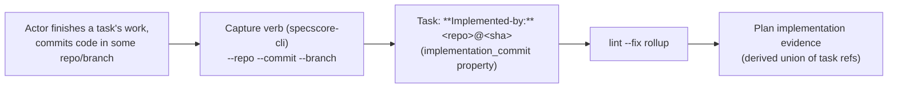

# Feature: Implementation Commit Provenance

> [SpecScore.**Studio**](https://specscore.studio): | [Explore](https://specscore.studio/app/github.com/specscore/specscore/spec/features/implementation-commit-provenance?op=explore) | [Edit](https://specscore.studio/app/github.com/specscore/specscore/spec/features/implementation-commit-provenance?op=edit) | [Ask question](https://specscore.studio/app/github.com/specscore/specscore/spec/features/implementation-commit-provenance?op=ask) | [Request change](https://specscore.studio/app/github.com/specscore/specscore/spec/features/implementation-commit-provenance?op=request-change) |
**Status:** Approved
**Source Ideas:** implementation-commit-provenance

## Summary

An optional, single provenance reference linking an implemented Task to the actual code commit that implemented it — a cross-repo `<repo>@<sha>` reference (optional branch) carried on the Task. When code is lost to a merge/rebase, the recorded reference is durable evidence that the work existed and a pointer to recover it. A Plan's implementation evidence is the derived rollup of its tasks' provenance references; it is a distinct axis from the existing plan `## Snapshots` Git Hash, which records spec-document state.

This Feature defines the **data model and methodology** only: the optional Task property, the reference format, the plan-level rollup, and the syntactic validation contract. The CLI capture verb that writes it is specified in `specscore-cli`; the agent-facing skill that calls that verb is specified in `ai-plugin-specscore`.

## Problem

A Plan can show as `Implemented` while the code that implemented it has been lost to a merge, rebase, or branch deletion — with no durable evidence the work ever existed and no pointer to restore it. The existing safeguards do not cover this:

- The plan `## Snapshots` table records a git hash, but per [plan#req:snapshot-git-hash](../plan/README.md#req-snapshot-git-hash) that hash is *the plan's state* — the **spec-repo** commit of the plan document, not the implementing **code** commit (which the [Plan feature](../plan/README.md) notes lives in *code repos on branches*, often a separate repo).
- Commit→work linkage exists only via `Verifies:` commit trailers, which live *inside* commit messages — destroyed by the very rebase/merge that loses the work.
- A [Task](../task/README.md) carries a `status` (`complete`/`failed`/…) but **no field** to record the commit that implemented it.

So there is no durable, artifact-level record pointing from an implemented Task (or, by rollup, a Plan) to the code commit that did the work.

## Behavior

### Task implementation-commit provenance

This topic defines the optional provenance reference carried on a Task and the rules that keep it durable evidence rather than a guess.

#### REQ: optional-provenance

A Task MAY carry a single implementation-commit provenance reference recording the code commit that implemented it. The reference is **optional** — a Task with no provenance is valid, and recording provenance MUST NOT be a precondition for a Task reaching `complete`. The reference is surfaced on the Task as an `**Implemented-by:**` field and is backed by the optional `implementation_commit` property on the [Task entity](task.entity.md).

#### REQ: provenance-ref-format

An implementation-commit provenance reference MUST take the form `<repo>@<sha>` with an OPTIONAL trailing branch in parentheses: `<repo>@<sha> (<branch>)`. `<repo>` is EITHER a **repo slug** (reusing the slug vocabulary of the cross-repo soft-reference convention in [plan#req:cross-repo-parent-ref](../plan/README.md#req-cross-repo-parent-ref)) **or a full git clone URL** (for code repos that are not SpecScore-managed siblings). Note the **separator differs** from a cross-repo plan parent: provenance joins repo and commit with `@<sha>`, not the `:<slug>` of `P-005`, so a `P-005` colon parser MUST NOT be reused verbatim. `<repo>` is OPTIONAL when the implementing commit lives in the same repository as the spec, in which case a bare `<sha>` (optionally `<sha> (<branch>)`) is permitted. `<sha>` is a git commit hash (a 7–40 character hex string).

#### REQ: provenance-validated-syntactically

The provenance reference MUST be validated **syntactically only** — its shape per [provenance-ref-format](#req-provenance-ref-format) is checked, but the linter MUST NOT scan the referenced repository to confirm the `<sha>` exists or is reachable. This mirrors the cross-repo precedent in [plan#req:cross-repo-parent-ref](../plan/README.md#req-cross-repo-parent-ref) (lint rule `P-005`): a cross-repo reference is a best-effort, unresolved pointer.

#### REQ: provenance-is-actor-supplied-not-derived

The provenance reference, when present, names the commit that implemented the Task's work, and is **actor-supplied**: the data model defines no mechanism to auto-derive it from ambient `git HEAD`, and a reader/linter MUST NOT populate it from the current working tree. (*When* and *how* it is captured — at task completion, via the supplying actor — is the capture verb's concern, specified in `specscore-cli`; this REQ governs only the data-model guarantee that the value is never inferred.)

### Plan-level evidence rollup

This topic defines how a Plan's implementation evidence is composed from its tasks.

#### REQ: plan-evidence-is-rollup

A Plan's implementation evidence is the **derived** set of its tasks' implementation-commit provenance references. It MUST NOT be hand-authored at the plan level; like the plan execution-band status (see [plan#req:status-rollup](../plan/README.md#req-status-rollup)), it is a read-only rollup of task-level data. A Plan with no task-level provenance has empty implementation evidence. The rollup is surfaced **query-only** — emitted on demand by `specscore plan info`, NOT written into the plan body or frontmatter — so completions add no managed-content churn to the plan file.

### Relationship to Snapshots

This topic fixes the boundary against the existing plan Snapshots mechanism so the two are not conflated.

#### REQ: distinct-from-snapshots

Implementation-commit provenance is the **code-commit** axis and is distinct from the plan `## Snapshots` Git Hash, which is the **spec-document state** axis ([plan#req:snapshot-git-hash](../plan/README.md#req-snapshot-git-hash)). The two coexist on a Plan and MUST NOT be merged: provenance MUST NOT be written into the Snapshots table, and a Snapshot Git Hash MUST NOT be reinterpreted as an implementing code commit.

## Architecture & components

- **`implementation_commit` property on the [Task entity](task.entity.md)** — the typed, optional string property that holds the provenance reference. It is the single source of truth for the data shape; the `**Implemented-by:**` Markdown field is its document surface.
- **Plan-level rollup** — a derived view (owned by `specscore spec lint --fix`, alongside the existing status rollup and `tasks_count`) that aggregates child tasks' `implementation_commit` values into the Plan's implementation evidence. No new stored plan field is required by the MVP beyond what rollup surfaces.
- **Syntactic validator** — a lint check (implemented in `specscore-cli`) enforcing [provenance-ref-format](#req-provenance-ref-format) without resolving the reference.

Capture is **out of this Feature**: the `specscore-cli` `task change-status` verb writes the property, and the `ai-plugin-specscore` change-status skill invokes that verb. This Feature is the contract those two consume.

## Data flow

## Error handling & failure modes

| Failure | Surface | Outcome |
|---|---|---|
| Provenance reference malformed (not `<repo>@<sha>`) | `specscore spec lint` | Lint violation citing [provenance-ref-format](#req-provenance-ref-format); the reference is rejected. |
| Referenced `<sha>` does not exist / is unreachable in `<repo>` | — | NOT detected by design — validation is syntactic only ([provenance-validated-syntactically](#req-provenance-validated-syntactically)). Recovery and reachability are out of scope (see Not Doing). |
| Provenance absent on a `complete` Task | — | Valid — provenance is optional ([optional-provenance](#req-optional-provenance)). No violation. |

## Testing strategy

The reference-format validation is enforced and unit-tested in `specscore-cli` (where the lint rule lives). This Feature is a methodology/data-model contract in the spec repo; its REQs are validated by the consuming CLI/skill Features' tests and by spec lint over example artifacts. See [Rehearse Integration](#rehearse-integration).

## Rehearse Integration

No Rehearse stubs are scaffolded. This Feature defines a data-model and methodology contract (an optional entity property, a reference format, a derived rollup, and a syntactic-validation rule). Its observable enforcement surface — the lint rule and the capture verb — is owned and tested in `specscore-cli`; the agent flow is owned in `ai-plugin-specscore`. There is no behavior in this repo for Rehearse to drive directly.

## Not Doing / Out of Scope

Inherited from the [source Idea](../../ideas/implementation-commit-provenance.md), plus spec-level cuts:

- Reachability detection / lost-commit warnings — MVP is evidence-only; restoration is manual via the recorded `<repo>@<sha>`.
- Assisted restore (auto cherry-pick / recover).
- Automatic capture from ambient `git HEAD` — rejected: multi-branch/worktree work means tooling cannot know which commit; the actor supplies it ([provenance-is-actor-supplied-not-derived](#req-provenance-is-actor-supplied-not-derived)).
- Verifying the `<sha>` exists in `<repo>` — syntactic-only validation ([provenance-validated-syntactically](#req-provenance-validated-syntactically)).
- Recording multiple commits per task — the MVP records one primary commit (squash-merge friendly).
- Overloading or changing Snapshot semantics ([distinct-from-snapshots](#req-distinct-from-snapshots)).
- The capture verb and the agent skill — specified in `specscore-cli` and `ai-plugin-specscore` respectively.

## Assumption carryover

From the [source Idea](../../ideas/implementation-commit-provenance.md):

- **Resolved (was Must-be-true): a `task change-status` capture path exists.** During specify this was found to conflict with the Stable [`cli/lifecycle-transitions#req:scope-no-task-lifecycle`](https://github.com/specscore/specscore-cli/blob/main/spec/features/cli/lifecycle-transitions/README.md) contract. Direction chosen: build a task-kind status-change verb in `specscore-cli` and amend that contract (tracked in the `specscore-cli` Feature). This Feature stays representation-agnostic and does not depend on the capture mechanism.
- **Carried (Must-be-true): the actor passes the correct `<repo>@<sha>`.** Garbage-in makes the evidence worthless; validated only at the capture/recovery rehearsal in the consuming repos.
- **Carried (Should-be-true): a syntactic-only `<repo>@<sha>` ref is acceptable evidence** — encoded as [provenance-validated-syntactically](#req-provenance-validated-syntactically).
- **Carried (Should-be-true): one primary commit per task suffices for MVP** — encoded in Not Doing.

## Interaction with Other Features

| Feature | Interaction |
|---|---|
| [Task](task.entity.md) | Gains the optional `implementation_commit` property; the `**Implemented-by:**` field is its document surface. |
| [Plan](../plan/README.md) | Plan implementation evidence is the rollup of its tasks' provenance; distinct from the plan `## Snapshots` Git Hash. |
| [Plan / Snapshots](../plan/README.md#snapshots) | Explicit boundary — provenance is the code-commit axis, Snapshots the spec-state axis ([distinct-from-snapshots](#req-distinct-from-snapshots)). |

## Acceptance Criteria

### AC: provenance-is-optional

**Requirements:** implementation-commit-provenance#req:optional-provenance

Scenario: A completed task without provenance is valid
Given a Task that has reached `complete` and carries no `**Implemented-by:**` field
When `specscore spec lint` runs over it
Then no violation is reported and the Task is accepted (provenance is optional, never a precondition for completion).

### AC: well-formed-ref-accepted

**Requirements:** implementation-commit-provenance#req:provenance-ref-format, implementation-commit-provenance#req:provenance-validated-syntactically

Scenario: A syntactically valid cross-repo reference passes without repo resolution
Given a Task whose `implementation_commit` is `backstage@a1b2c3d (feature/foo)`
When `specscore spec lint` runs
Then the reference is accepted on its shape alone, and the linter does not scan the `backstage` repository to confirm the commit exists.

### AC: malformed-ref-rejected

**Requirements:** implementation-commit-provenance#req:provenance-ref-format

Scenario: A reference that is not <repo>@<sha> is rejected
Given a Task whose `implementation_commit` is `not a commit ref`
When `specscore spec lint` runs
Then a lint violation is reported citing the `provenance-ref-format` requirement.

### AC: same-repo-bare-sha

**Requirements:** implementation-commit-provenance#req:provenance-ref-format

Scenario: A bare sha is permitted for same-repo implementations
Given a Task whose `implementation_commit` is `a1b2c3d` (no repo prefix) in a project where spec and code share a repo
When `specscore spec lint` runs
Then the bare sha is accepted as a valid same-repo reference.

### AC: provenance-never-inferred

**Requirements:** implementation-commit-provenance#req:provenance-is-actor-supplied-not-derived

Scenario: Reading a task never auto-fills provenance from the working tree
Given a Task with no `implementation_commit` value, read inside a git working tree whose `HEAD` is some commit
When the Task is read or linted
Then `implementation_commit` remains empty — it is not populated from the ambient `HEAD` — because provenance is actor-supplied, never inferred.

### AC: plan-evidence-rolls-up

**Requirements:** implementation-commit-provenance#req:plan-evidence-is-rollup

Scenario: Plan implementation evidence derives from its tasks
Given a Plan with two tasks, each carrying an `implementation_commit` reference
When the plan's implementation evidence is computed
Then it equals the set of the two tasks' references, and no implementation-commit evidence is hand-authored at the plan level.

### AC: snapshots-stay-distinct

**Requirements:** implementation-commit-provenance#req:distinct-from-snapshots

Scenario: Provenance and Snapshots are not conflated
Given a Plan that has both a `## Snapshots` table (with a spec-state Git Hash) and tasks carrying implementation-commit provenance
When the Plan is read
Then the Snapshots Git Hash and the implementation-commit references are surfaced as distinct records, and neither is written into the other's field.

## Open Questions

- ~~Exact on-disk surface of the rollup~~ — **Resolved:** query-only via `specscore plan info` (no plan-body/frontmatter write), per [plan-evidence-is-rollup](#req-plan-evidence-is-rollup).
- ~~Whether `<repo>` should also accept a full clone URL~~ — **Resolved:** yes, `<repo>` is a repo slug **or** a full clone URL, per [provenance-ref-format](#req-provenance-ref-format).

---
*This document follows the https://specscore.md/feature-specification*
