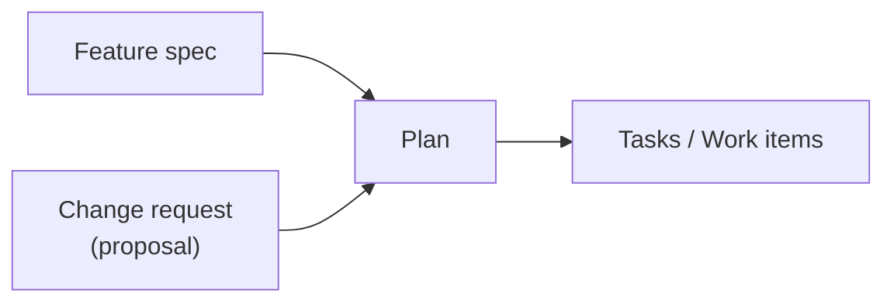
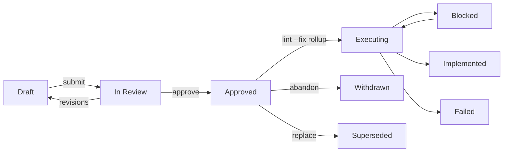
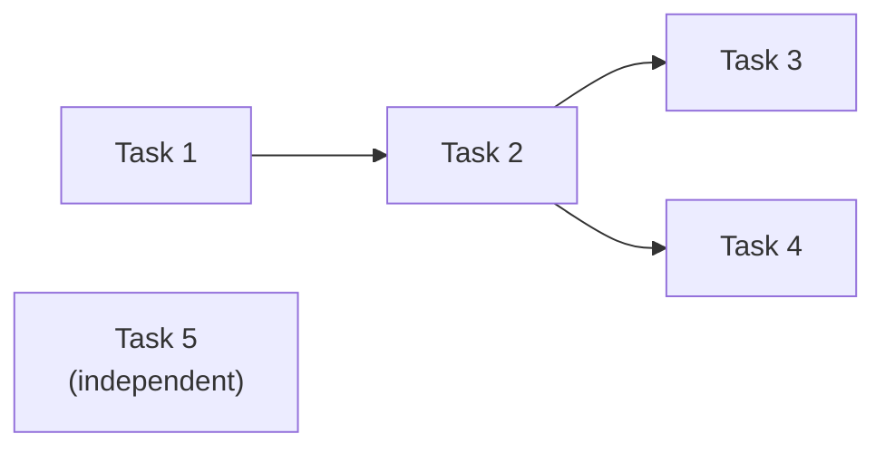
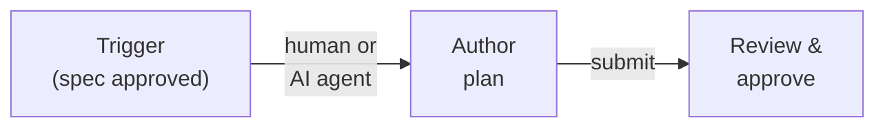
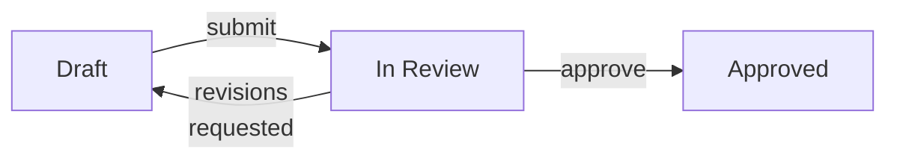

# Feature: Plan

> [SpecScore.**Studio**](https://specscore.studio): | [Explore](https://specscore.studio/app/github.com/specscore/specscore/spec/features/plan?op=explore) | [Edit](https://specscore.studio/app/github.com/specscore/specscore/spec/features/plan?op=edit) | [Ask question](https://specscore.studio/app/github.com/specscore/specscore/spec/features/plan?op=ask) | [Request change](https://specscore.studio/app/github.com/specscore/specscore/spec/features/plan?op=request-change) |

**Status:** Stable

## Summary

A plan is a composite task -- a task that contains subtasks. It bridges feature specifications and change requests to executable work. Plans are mutable documents; snapshots provide immutable reference points for review, approval, and retrospective.

There is one structural concept: the **task**. A task with children is a plan. A task without children is a leaf task. A plan is normally a single flat file (`spec/plans/{slug}.md`) whose tasks are inline `### Task N:` blocks; it MAY optionally be decomposed into sub-plans (recursive nesting, no depth limit) as a reserved advanced form. The typed shape of a single Plan is captured in the co-located [plan entity](plan.entity.md).

## Contents

| Directory | Description |
|---|---|
| [_tests](_tests/README.md) | Test scenarios validating plan feature requirements |

The Plan document type has a companion Index-Kind feature, [plans-index](../plans-index/README.md), which specifies the shape of the `spec/plans/README.md` aggregation file every repo maintains. Plans-Index lives as a top-level sibling of Plan under `spec/features/` — not as a sub-feature — so its specification URL stays flat (`plans-index-specification`, not a nested compound).

## Problem

Teams have well-defined execution systems -- work items, tickets, tasks -- but there is no structured way to go from "we know what to build" to "here are the work items to execute."

Today that decomposition happens ad hoc -- a human or AI agent reads a feature spec, mentally breaks it into tasks, and manually creates work items one by one. This creates three problems:

- **No review gate.** Work begins without explicit approval of the approach. A bad decomposition wastes time and effort.
- **No stable reference.** Work items are designed to be fluid -- agents add subtasks, humans cancel items, parallel work gets restructured. This fluidity is a feature of execution, but it means there is no fixed record of what was originally planned.
- **No retrospective anchor.** Without a snapshot of intent, you cannot compare what was planned against what actually happened. Lessons learned require a before-and-after.

## Design Philosophy

SpecScore separates **intent** from **execution** by design, with distinct artifacts for each stage of the workflow.

| Artifact | Question it answers | Audience | Mutability | Lives in |
|---|---|---|---|---|
| Feature spec | What do we want? | Product, engineering | Versioned | Spec repo |
| Change request | What should change in an existing feature? | Product, engineering | Versioned until approved | Spec repo |
| Plan | How will we build it? | Reviewers, planners | Mutable; snapshots provide fixed references | Spec repo |
| Work items | Who's doing what right now? | Agents, operators | Highly fluid | Execution system |

A **feature spec** defines something new. A **change request** (implemented as a [proposal](../proposals/README.md)) mutates something that already exists. Both are *what* artifacts -- they describe desired outcomes. The distinction matters because:

- **New features** start from a blank slate. The plan is unconstrained.
- **Change requests** operate on existing behavior. The plan must account for what is already there -- migration paths, backward compatibility, affected dependents. The review process is different: reviewers need to understand the delta, not just the destination.

From the planning pipeline's perspective, both converge to the same output -- a plan that produces executable tasks:



**Why not use the work item tree as the plan?** Work items are designed to be fluid. Agents add subtasks when they discover complexity. Humans cancel items when priorities shift. Parallel work gets restructured on the fly. This fluidity is a feature -- it is how real development works. But fluidity is the enemy of reviewability. A human reviewer needs a stable, scannable document to approve before work begins. Snapshots provide that stability without sacrificing the ability to evolve the plan.

**No duplicated status tracking.** The plan does not track completion -- execution tools do. A progress view can be derived by mapping plan tasks to their linked work items and looking up live status. One source of truth, two views: the plan view for humans, the deep work item tree for agents.

## Behavior

### Plan location

A plan is a single Markdown file under `spec/plans/` in the spec repository:

```text
spec/plans/
  README.md              <- index of all plans
  {plan-slug}.md         <- the plan document (one flat file per plan)
```

`{plan-slug}` is a URL/path-safe identifier (e.g., `add-batch-mode`, `user-auth`).

#### REQ: plan-file

Every plan MUST be a single Markdown file `spec/plans/{plan-slug}.md`. This single-file form is the contract enforced by `specscore spec lint` (lint rule `P-003`). The optional decomposition of a plan into sub-plans (see [Recursive task and plan model](#recursive-task-and-plan-model)) is a reserved advanced form, not currently required or enforced.

#### REQ: plan-slug-format

Plan slugs MUST be lowercase, hyphen-separated, and URL-safe. Underscores, spaces, and special characters MUST NOT be used.

#### REQ: source-binding

Every plan MUST declare exactly one source in its header: either a `**Source Feature:**` line naming the Feature it decomposes, or a `**Source:** idea:{slug}` line naming the Idea it plans directly. A plan that declares neither, or both, is invalid.

### Plan document structure

```markdown
# Plan: Add batch mode to CLI

**Status:** Approved
**Source Feature:** cli
**Date:** 2026-03-14
**Owner:** @alex
**Supersedes:** —

## Summary

1-3 sentences. What this plan covers and how it decomposes the source
Feature (or, for an idea-sourced plan, the source Idea).

## Approach

<=1 paragraph on the decomposition strategy: what was grouped, what was
deferred and why.

## Tasks

### Task 1: Define batch input schema

**Verifies:** cli#ac:batch-schema-validates

Establish the YAML/JSON schema for batch input files. This determines
the contract for all downstream tasks.

### Task 2: Implement batch parser

**Verifies:** cli#ac:batch-parser-rejects-invalid

Parse and validate batch input files against the schema from Task 1,
rejecting invalid files with per-field error messages.

### Task 3: Update CLI entry point

**Verifies:** cli#ac:batch-flag-in-help

Add the `--batch <file>` flag and wire it to the parser; surface it in
help output, mutually exclusive with positional arguments.

## Deferred AC Coverage

<!-- Omit this section entirely when no ACs are deferred. -->

## Open Questions

None at this time.

---
*This document follows the https://specscore.md/plan-specification*
```

#### REQ: plan-title-format

Every plan document MUST use the `# Plan: {Title}` format for its title. The `Plan:` prefix is required.

#### REQ: plan-required-sections

Every plan document MUST include the following sections: title (`# Plan: X`), header metadata fields, `## Summary`, `## Approach`, `## Tasks`, and `## Open Questions`. A `## Deferred AC Coverage` section, `## Snapshots` section, and `## Dependency graph` section are OPTIONAL.

### Header fields

| Field | Required | Description |
|---|---|---|
| **Status** | Yes | Current plan status (see [Plan statuses](#plan-statuses)) |
| **Source Feature** | One of | Slug of the Feature this plan decomposes (feature-sourced plans) |
| **Source** | One of | `idea:{slug}` naming the Idea this plan decomposes (idea-sourced plans) |
| **Date** | Yes | Date the plan was created |
| **Owner** | Yes | Who wrote the plan |
| **Supersedes** | Yes | `—`, or the slug of an older plan this one wholesale-replaces |
| **Effort** | No | `S` \| `M` \| `L` \| `XL` -- see [Optional ROI metadata](#optional-roi-metadata) |
| **Impact** | No | `low` \| `medium` \| `high` \| `critical` -- see [Optional ROI metadata](#optional-roi-metadata) |

#### REQ: required-header-fields

Every plan MUST include these header fields: Status, the source line (exactly one of `Source Feature` or `Source: idea:{slug}`, per [source-binding](#req-source-binding)), Date, Owner, and Supersedes. Effort and Impact are OPTIONAL.

#### REQ: proposal-forward-reference

When a plan is triggered by a change request (proposal), the Source field MUST link directly to the proposal. The proposal in turn MUST include a forward reference to the plan.

When a plan is triggered by a change request (proposal), the **Source** field links directly to the proposal. The proposal in turn gets a forward reference to the plan:

```markdown
# Proposal: Deprecate v1 endpoints

| Field  | Value                                             |
|--------|---------------------------------------------------|
| Status | `approved`                                        |
| Plan   | [migrate-to-v2](../../../plans/migrate-to-v2.md)  |
```

### Plan statuses

A plan's status models its full lifecycle in one field, in three bands. The values are capitalized, matching the SpecScore-wide status vocabulary used by Features and Ideas; the frontmatter `status:` mirror (per [artifact-frontmatter-convention](../artifact-frontmatter-convention/README.md)) carries the same value verbatim.

| Band | Status | Description | Set by |
|---|---|---|---|
| Prep | `Draft` | Plan is being written, not ready for review | Human author |
| Prep | `In Review` | Submitted for review | Human author |
| Prep | `Approved` | Reviewed and approved — ready/pending execution | Human author |
| Execution | `Executing` | At least one task in progress | Derived by `lint --fix` |
| Execution | `Blocked` | Tasks blocked; none progressing and none failed | Derived by `lint --fix` |
| Execution | `Implemented` | All tasks complete | Derived by `lint --fix` |
| Execution | `Failed` | A task failed/aborted and the plan cannot complete | Derived by `lint --fix` |
| Disposition | `Withdrawn` | Abandoned | Human author |
| Disposition | `Superseded` | Replaced by a named successor plan | Human author |

The bands are sequential phases of one lifecycle, not concurrent: reaching `Executing` already implies the approval gate passed (or was deliberately bypassed), so `Approved` carries no additional current-state information during a run. The authority handoff sits at `Approved`: `lint --fix` only ever transitions from `Approved` onward (deriving the execution band from task-status rollup) and MUST NEVER overwrite a human-authored prep state. Plans are mutable; if the approach changes after approval, edit the plan and record a new snapshot rather than creating a separate document.

#### REQ: valid-statuses

A plan's Status field MUST be one of: `Draft`, `In Review`, `Approved`, `Executing`, `Blocked`, `Implemented`, `Failed`, `Withdrawn`, or `Superseded`. No other values are permitted. A `Superseded` plan MUST carry a reference to its successor plan.

#### REQ: execution-status-derived

The execution-band statuses (`Executing`, `Blocked`, `Implemented`, `Failed`) MUST NOT be hand-authored. They are derived by `specscore spec lint --fix` from the rollup of the plan's task statuses (see [Status rollup](#status-rollup)), and `lint --fix` transitions only from `Approved` onward, never overwriting a `Draft`/`In Review`/`Approved` prep state.

### Status transitions



#### REQ: status-transitions

Plan status transitions MUST follow these rules. **Prep (human-authored):** `Draft` MAY transition to `In Review`; `In Review` MAY transition back to `Draft` (revisions requested) or forward to `Approved`. **Execution (derived by `lint --fix`, only from `Approved` onward):** `Approved` MAY transition to an execution-band status; execution statuses transition among themselves per the task-status rollup. **Disposition (human-authored):** `Approved` (or a later state) MAY transition to `Withdrawn` or `Superseded`. There is no resurrection from a disposition status — re-pursuing the work means authoring a new plan. No other transitions are permitted.

### Snapshots

A snapshot is an immutable reference point within a plan's history. Instead of freezing the entire plan on approval, snapshots record meaningful moments -- approval, checkpoints, completion -- as entries in a table with a corresponding git commit hash.

Snapshots remove the need to freeze a plan on approval. A plan can be edited freely at any time. When a reference point is needed, a snapshot captures the plan's state at that git hash. The snapshot table lives in the plan document:

```markdown
## Snapshots

| Date | Git Hash | Action | Comment |
|---|---|---|---|
| 2026-03-15 | `a1b2c3d` | approved | Initial approval by @jordan |
| 2026-03-20 | `e4f5g6h` | checkpoint | Added streaming support task |
| 2026-04-01 | `i7j8k9l` | completed | All tasks verified |
```

#### REQ: snapshot-table-format

When a plan includes snapshots, they MUST be recorded in a `## Snapshots` section containing a table with columns: Date, Git Hash, Action, and Comment.

#### REQ: snapshot-actions

Snapshot actions include `approved`, `checkpoint`, `completed`, and user-defined values. The `approved` action SHOULD correspond to setting the plan status to `Approved`.

#### REQ: snapshot-git-hash

Each snapshot MUST reference a valid git commit hash that represents the plan's state at the time the snapshot was taken.

### Recursive task and plan model

> **Optional / reserved advanced form.** The default and lint-enforced shape of a plan is a single flat file (`spec/plans/{slug}.md`, per [plan-file](#req-plan-file)) whose tasks are inline `### Task N:` blocks. The recursive directory decomposition described below is an OPTIONAL advanced form for very large plans; it is **not currently enforced or required** by `specscore spec lint` (which enforces the single-file contract via `P-003`). It is documented here as the reserved model for future sub-plan support.

A plan is a composite task -- it contains other tasks. Some of those child tasks may themselves contain subtasks, making them sub-plans. This nesting is recursive with no artificial depth limit.

```text
spec/plans/
  README.md                          <- index
  chat-feature/
    README.md                        <- plan (composite task)
    chat-infrastructure/
      README.md                      <- sub-plan (also a composite task)
      set-up-database/
        README.md                    <- task (leaf)
      configure-networking/
        README.md                    <- task (leaf)
    chat-workflow-engine/
      README.md                      <- sub-plan
    send-notifications/
      README.md                      <- task (leaf, sibling of sub-plans)
  e2e-testing-framework/
    README.md                        <- plan (standalone, no sub-plans)
```

Whether something is a "plan" or a "task" is determined by structure: if it has children, it is a plan. If it has no children, it is a task. The same document format applies at every level.

#### REQ: recursive-nesting

In the optional directory form, plans and tasks MAY nest to arbitrary depth. There is no maximum nesting level. Depth is a judgment call made by the plan author. The single-file form (the default and lint-enforced shape) carries its tasks as inline `### Task N:` blocks rather than child directories.

#### REQ: child-plan-format

A sub-plan (child plan) MUST follow the same format as a top-level plan, including tasks and acceptance criteria.

### Mixed children

Tasks and sub-plans can coexist at the same level within a plan. There is no requirement to separate them or force restructuring. In the example above, `send-notifications` (a leaf task) is a sibling of `chat-infrastructure` and `chat-workflow-engine` (sub-plans).

#### REQ: mixed-children

A plan MAY contain both leaf tasks and sub-plans as direct children at the same level. No restructuring is required to separate tasks from sub-plans.

### Status rollup

Once a plan is `Approved`, its execution-band status is derived from the rollup of its task statuses. This is what `lint --fix` maintains; it never runs while the plan is in a prep state (`Draft`/`In Review`/`Approved` are human-owned).

| Condition (task-status rollup) | Derived plan status |
|---|---|
| A task is `failed`/aborted and the plan cannot complete | `Failed` |
| At least one task is `in_progress` | `Executing` |
| Tasks are blocked; none in progress and none failed | `Blocked` |
| All tasks are complete | `Implemented` |

Precedence is top-to-bottom: `Failed` wins over `Executing`, which wins over `Blocked`, which wins over `Implemented`.

#### REQ: status-rollup

When a plan is `Approved` or in an execution-band status, `specscore spec lint --fix` MUST derive the plan's execution-band status from the rollup of its task statuses per the precedence above. The rollup reads task status only — it MUST NOT write task status, and MUST NOT overwrite a human-authored prep (`Draft`/`In Review`/`Approved`) or disposition (`Withdrawn`/`Superseded`) status.

### Task count

A plan carries a derived count of its tasks, surfaced in frontmatter so external tools can size a plan without parsing its body.

#### REQ: tasks-count

A plan MUST carry a derived `tasks_count` recording the number of its direct child tasks. The value is maintained by `specscore spec lint --fix` and surfaced in the plan's frontmatter per the [artifact-frontmatter-convention](../artifact-frontmatter-convention/README.md) feature. Authors MUST NOT hand-maintain `tasks_count`; lint reconciles it from the actual task children.

### Tasks and dependencies

Tasks whose `Depends on` is `none` may execute in parallel. The dependency graph determines the critical path.

For complex plans, an optional **Dependency graph** section visualizes the parallelism:



This section is optional -- useful for complex plans, noise for simple sequential ones.

#### REQ: parallel-eligibility

Tasks whose `Depends on` value is `none` MUST be treated as parallel-eligible. Because `Depends on` is now required on every task (see [task#req:task-required-fields](../task/README.md#req-task-required-fields)), parallel-eligibility keys off the explicit `none` value rather than an absent field. The dependency graph determines the critical path; tasks with no dependencies MAY execute concurrently.

### Task-to-feature-AC traceability

In the flat single-file model, a plan does not embed its own acceptance-criteria sections. Instead, each task declares a `**Verifies:**` line naming one or more acceptance criteria of the source Feature (by `feature-slug#ac:<ac-slug>`) that the task implements. This is the plan's traceability mechanism — every task maps to the feature ACs it satisfies — and it is enforced by lint rule `P-001` (every plan task references at least one feature AC).

#### REQ: task-verifies-feature-ac

Every task in a plan MUST declare a `**Verifies:**` line referencing one or more acceptance criteria of the plan's source Feature, in the form `feature-slug#ac:<ac-slug>` (comma-separated when more than one). A task with no such reference is rejected by lint rule `P-001`. Feature ACs that the plan does not yet cover are recorded under the optional `## Deferred AC Coverage` section. (Idea-sourced plans, which have no source Feature, are exempt from `P-001`.)

### Optional ROI metadata

Two optional fields can be added to the plan document header:

```markdown
**Effort:** S | M | L | XL
**Impact:** low | medium | high | critical
```

Both fields are **optional**. When absent, tooling may infer effort from task count, dependency depth, and acceptance criteria complexity. It may infer impact from feature importance and downstream dependents. During plan authoring, the tooling **suggests** values. The user accepts, declines, or overwrites.

For composite plans, effort/impact describe the aggregate. Sub-plans carry independent estimates.

#### REQ: effort-values

When present, the Effort field MUST be one of: `S`, `M`, `L`, or `XL`.

#### REQ: impact-values

When present, the Impact field MUST be one of: `low`, `medium`, `high`, or `critical`.

#### Effort scale

| Effort | Rough meaning |
|--------|---------------|
| S | A few hours of focused work, 1-3 tasks |
| M | A few days, 3-6 tasks, limited dependencies |
| L | A week or more, 5-10 tasks, cross-cutting |
| XL | Multi-week, many tasks, multiple sub-plans or deep dependencies |

#### Impact scale

| Impact | Rough meaning |
|--------|---------------|
| low | Nice-to-have, no users blocked |
| medium | Improves existing capability, some users benefit |
| high | Enables important new capability, many users benefit |
| critical | Unblocks core functionality or other critical work |

### Plans index

Every spec repository with plans maintains an index at `spec/plans/README.md`. Its format — required sections, Contents-table columns, Recently Closed section, and adherence footer — is specified by the [plans-index](../plans-index/README.md) Index-Kind feature.

### Feature README back-reference

Each affected feature's README includes a **Plans** section linking to plans that touch it. Features can reference both top-level plans and sub-plans -- the path disambiguates:

```markdown
## Plans

| Plan                                                                  | Status    | Author | Approved   |
|-----------------------------------------------------------------------|-----------|--------|------------|
| [chat-feature](../../plans/chat-feature.md)                           | Draft     | @alex  | -          |
| [user-auth](../../plans/user-auth.md)                                 | Approved  | @alex  | 2026-03-15 |
| [add-batch-mode](../../plans/add-batch-mode.md)                       | In Review | @alex  | -          |
```

A feature appearing in both a plan and its sub-plan is valid -- the plan covers it broadly, the sub-plan implements a slice. A feature linked only to a top-level plan (no sub-plan yet) signals "planned but not decomposed."

#### REQ: feature-back-reference

Each affected feature's README MUST include a Plans section with a table linking to plans that touch it. The table MUST include columns for Plan, Status, Author, and Approved.

### Task artifacts

An artifact is a named output that a task produces. It is not code (code lives in code repos on branches). It is the metadata, decisions, schemas, and intermediate results that downstream tasks need to do their work.

Examples:

| Artifact | Produced by | Consumed by |
|---|---|---|
| JSON Schema definition | "Define data model" task | "Implement endpoints" task, "Build UI" task |
| API contract (OpenAPI snippet) | "Design API" task | "Implement client" task, "Write integration tests" task |
| Migration plan | "Analyze existing data" task | "Write migration script" task |
| Architecture decision record | "Evaluate auth approach" task | All downstream tasks |
| Test fixtures / seed data | "Generate test data" task | Any task running tests |

#### REQ: artifact-declaration

Plan tasks that produce outputs SHOULD declare them using the `**Produces:**` field with a bulleted list of named artifacts and their descriptions.

#### REQ: artifact-dependency-flow

When a task depends on another task, it MUST have access to that task's declared artifacts. The dependency is made explicit through the `Depends on` and `Produces` fields.

## Workflow

The planning pipeline has three stages. Each can be performed by a human or an AI agent.



### Stage 1: Trigger

Something initiates the need for a plan:

| Trigger | Source |
|---|---|
| New feature spec approved | `spec/features/{feature}/README.md` |
| Change request (proposal) approved | `spec/features/{feature}/proposals/{proposal}/` |
| Manual request | Human decides work is needed |

If auto-planning is enabled in the project configuration, tooling can automatically create a `Draft` plan when a feature spec or proposal reaches `Approved` status. If disabled (the default), a human or external tool initiates plan creation explicitly.

### Stage 2: Author the plan

The plan author (human or AI agent) writes the plan document following the structure defined above.

**When authored by a human:** Write the markdown directly. The spec tooling scaffolds the plan file and template (`specscore plan new`).

**When authored by an AI agent:** The agent receives the feature spec or approved proposal as input context, along with relevant codebase context, and produces the plan document. The agent should have access to:

- The feature spec or approved proposal
- Existing codebase structure (for change requests)
- Other active plans (to avoid conflicts)
- Project conventions

### Stage 3: Review and approve



The review process transitions the plan from `Draft` to `In Review`, and upon approval sets the status to `Approved` and creates an `approved` snapshot. The plan remains editable after approval -- future changes are tracked through additional snapshots, and once execution begins `lint --fix` derives the execution-band status from task rollup.

### After approval: Execution handoff

Once approved, the plan's tasks can be consumed by execution tools to generate work items. The exact mechanism depends on the orchestration tool used. For Synchestra integration, see [synchestra.io](https://synchestra.io).

Execution is handled by the orchestration tool, not SpecScore. The plan remains a living document during execution, with snapshots marking significant milestones.

## Integration with Execution Tools

Plan tasks can be mapped to execution units (tasks, work items) by orchestration tools. SpecScore defines the plan format; execution tools consume it.

Key integration points:

- Each plan task can carry metadata (like a task identifier) that execution tools use to create and link work items.
- `Depends on` fields in the plan map to dependency relationships in the execution system.
- Acceptance criteria from plan tasks can be copied into generated work item descriptions.

## Retrospective

Once all tasks reach terminal states, a deviation report can compare planned vs actual:

- **Planned tasks** vs. **actual work items** -- were tasks added, removed, or split?
- **Planned dependencies** vs. **actual execution order**
- **Planned acceptance criteria** vs. **outcomes**
- **Time estimates** (if provided) vs. **actual durations**

The report is a learning artifact. It can be stored alongside the plan:

```
spec/plans/{plan-slug}/
  README.md             <- the plan
  reports/
    README.md           <- deviation report
```

## What's Next Report

The What's Next report is an AI-generated prioritization document that surfaces what to work on next based on plan statuses, dependencies, and ROI metadata.

### Location

`spec/plans/WHATS-NEXT.md`

### Report structure

```markdown
# What's Next

**Generated:** 2026-03-24
**Mode:** incremental | full

## Completed Since Last Update

- [chat-infrastructure](chat-feature/chat-infrastructure/) -- completed 2026-03-20

## In Progress

- [hero-scene](hero-scene/) -- 2/4 tasks done, no blockers

## Recommended Next

1. **[chat-workflow-engine](chat-feature/chat-workflow-engine/)** -- Impact: high,
   Effort: M. Unblocked by chat-infrastructure completion. Advances the
   highest-impact plan.
2. **[agent-skills-framework](agent-skills-framework/)** -- Impact: medium, Effort: L.
   No blockers, independent of current momentum.

### Reasoning

Brief AI explanation of prioritization -- dependency unlocks, ROI ratio,
momentum, competing priorities.

## Open Questions

(ambiguities the AI surfaced during analysis)
```

### Update mechanism

- **Trigger:** plan completion events or status transitions.
- **Incremental mode:** reads previous `WHATS-NEXT.md` + the completion delta. Regenerates only affected sections. Minimizes token usage.
- **Full mode:** scans all features, plans, and statuses. Used for initial generation or to correct incremental drift.
- The file is **committed to git** after each update, providing a history of how priorities evolved over time.

### Prioritization inputs

The AI considers these signals in order of priority:

1. Explicit ROI metadata (effort/impact) when present
2. Dependency graph -- what is newly unblocked by recent completions
3. Momentum -- preference for advancing plans already in progress
4. Feature status -- features closer to "stable" get a boost
5. AI inference from plan complexity when ROI metadata is absent

## Project Configuration

Planning settings are configured in the repo config file. See [Repo Config](../repo-config/README.md).

### Adherence footer

#### REQ: adherence-footer

Every plan document MUST end with an adherence footer per the [Adherence Footer feature](../adherence-footer/README.md). The footer URL MUST be `https://specscore.md/plan-specification`.

## Interaction with Other Features

| Feature | Interaction |
|---|---|
| [Feature](../feature/README.md) | Features are the source artifacts that trigger plans. Plans list affected features; features back-reference active plans in their README. |
| [Task](../task/README.md) | A task is the atomic unit of work. A plan is a composite task -- it contains tasks. The plan feature defines the composite structure; the task feature defines the leaf node properties. |
| [Requirement](../requirement/README.md) | Requirements are `#### REQ:` subsections within a feature's Behavior section. Plan REQs define the rules for plan structure and lifecycle. |
| [Acceptance Criteria](../acceptance-criteria/README.md) | Plan-level and task-level ACs follow the same format as feature ACs. Snapshots provide immutable references to AC state at specific points. |
| [Scenario](../scenario/README.md) | Scenarios in `_tests/` validate plan REQs with concrete Given/When/Then flows. |
| [Proposals](../proposals/README.md) | A proposal (change request) is a trigger for plan creation. Approved proposals link forward to their plan; plans link back to their source proposal. |
| [Open Questions](../open-questions/README.md) | Plan tasks may surface open questions. These follow the existing question lifecycle. |
| [Plans Index](../plans-index/README.md) | The plans-index feature specifies the `spec/plans/README.md` aggregation file that lists every Plan in a repo. Plan documents conform to `plan-specification`; the plans-index file conforms to `plans-index-specification`. |

## Acceptance Criteria

### AC: plan-document-validity

**Requirements:** plan#req:plan-title-format, plan#req:plan-required-sections, plan#req:required-header-fields, plan#req:source-binding

A plan document has a correctly formatted title (`# Plan: {Title}`), all required sections present (`Summary`, `Approach`, `Tasks`, `Open Questions`), all required header fields populated (Status, the source line, Date, Owner, Supersedes), and exactly one source declared (`Source Feature` or `Source: idea:{slug}`). A document that violates any of these is rejected by validation.

### AC: plan-location-validity

**Requirements:** plan#req:plan-file, plan#req:plan-slug-format

A plan is a single slug-named Markdown file `spec/plans/{slug}.md` (not a directory). A plan written as a directory tree is rejected by the single-file lint contract; a flat file with a valid slug passes.

### AC: status-lifecycle

**Requirements:** plan#req:valid-statuses, plan#req:execution-status-derived, plan#req:status-transitions

A plan's status is always one of the nine defined values (`Draft`, `In Review`, `Approved`, `Executing`, `Blocked`, `Implemented`, `Failed`, `Withdrawn`, `Superseded`). Prep statuses are human-authored; the execution-band statuses are derived by `lint --fix` from task-status rollup and are never hand-set, and `lint --fix` only transitions from `Approved` onward. Status transitions follow the defined state machine.

### AC: snapshot-integrity

**Requirements:** plan#req:snapshot-table-format, plan#req:snapshot-actions, plan#req:snapshot-git-hash

Snapshots are recorded in a table with Date, Git Hash, Action, and Comment columns. Each snapshot references a valid git commit. Actions include `approved`, `checkpoint`, `completed`, and user-defined values. Snapshots provide immutable reference points without restricting plan mutability.

### AC: plan-structure-constraints

**Requirements:** plan#req:recursive-nesting, plan#req:mixed-children, plan#req:parallel-eligibility, plan#req:task-verifies-feature-ac, plan#req:status-rollup

In the optional directory form, plans nest recursively with no artificial depth limit and tasks and sub-plans coexist at the same level; the default single-file form carries inline `### Task N:` blocks. Tasks whose `Depends on` is `none` are parallel-eligible. Each task declares a `**Verifies:**` line mapping it to the source Feature's acceptance criteria (enforced by `P-001`). Once `Approved`, the plan's execution-band status derives from its task-status rollup via `lint --fix`.

### AC: tasks-count

**Requirements:** plan#req:tasks-count

A plan carries a derived `tasks_count` equal to its number of direct child tasks, maintained by `specscore spec lint --fix` and surfaced in frontmatter. The value is never hand-authored; lint reconciles it from the actual children.

### AC: cross-artifact-links

**Requirements:** plan#req:feature-back-reference, plan#req:proposal-forward-reference

Affected features back-reference plans in a Plans table. Proposals triggered by change requests include forward references to their plans. Bidirectional traceability is maintained.

## Open Questions

- How should plan tasks reference specific sections of a feature spec when the plan implements only part of a feature?
- What is the exact format for the plan task reference -- should it be structured metadata (YAML frontmatter) or a markdown convention (as shown in examples)?
- Should the deviation report be generated automatically when all tasks complete, or only on demand?
- `tasks_count` migration: existing plans gain `tasks_count` via `specscore spec lint --fix` on next touch (derived, never hand-authored), so no manual backfill is required. (Source Idea: `plan-granularity-improvement`.)
- This Feature was reconciled to the flat single-file model that lint actually enforces, and its status enum was expanded to the full prep/execution/disposition lifecycle realizing the Approved `plan-status-lifecycle` Idea. Open from that Idea: exact rollup precedence on mixed task states (encoded here as Failed > Executing > Blocked > Implemented — confirm against real `implement` runs); what triggers `lint --fix` to recompute the execution band (every lint run vs a hook vs the `implement` checkpoints); and whether `Failed` requires human acknowledgement to leave.
- The CLI enforcement of the expanded status enum and the `lint --fix` execution-band derivation are not yet implemented; until then plans use the prep-band statuses (`Draft`/`Approved`) as before. (Realizing Idea: `plan-status-lifecycle`.)

---
*This document follows the https://specscore.md/feature-specification*
