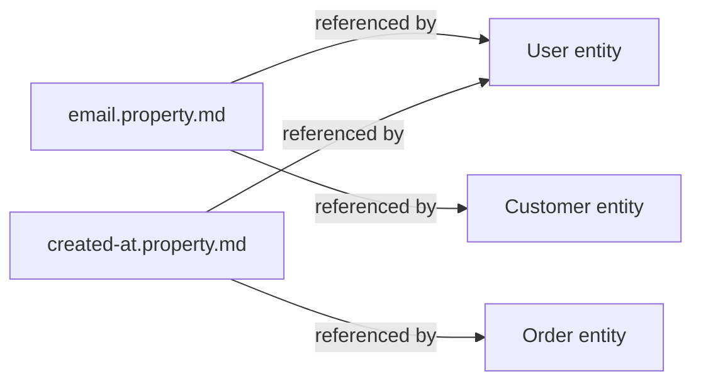

# Feature: Property

> [View in SpecStudio](https://specstudio.synchestra.io/project/features?id=specscore@specscore@github.com&path=spec%2Ffeatures%2Fproperty) — graph, discussions, approvals

**Status:** Approved
**Source Ideas:** entity-and-property-definitions

## Summary

A property is a reusable, standalone definition of a single business data field — its data type, its validation checks, and a human-readable description. Properties are SpecScore's smallest typed unit of business data: an `email` property defined once can be referenced from `User`, `Customer`, and `Contact` [entities](../entity/README.md) without copy-paste duplication.

A property artifact is a single markdown file at `spec/features/**/<slug>.property.md`. The YAML frontmatter is the **source of truth** — it carries the data type and the full set of structured checks in machine-readable form. The body has two sections: a hand-written `## Description` and a machine-maintained `## Referenced by` that lists every entity and feature that references the property.

## Problem

SpecScore today has no first-class way to describe a single reusable business field. When `email` shows up on `User`, `Customer`, and `Contact`, the validation rules (format, length, normalisation) are either re-stated three times in prose or omitted entirely. There is no canonical shape for downstream tooling (validators, code generators, datatug.io) to consume, and there is no traceable answer to "which features and entities depend on the definition of an email address?"

Inlining the same field shape into every owning entity would also work, but real spec repos hit reuse patterns within a quarter — once two entities share a field, the inline-only model forces drift. A standalone Property Doc-Kind solves both problems with one extra Doc-Kind in the meta-spec: one canonical definition, machine-readable, with maintained back-references.

## Design Philosophy

Properties are the **smallest typed unit** in SpecScore's business data layer:

| Layer | Granularity | Example |
|---|---|---|
| **Property** | **Single field** | **`email` — string, RFC 5322, ≤320 chars** |
| Entity | Bag of fields | `User` — has `id`, `email`, `name`, `created_at` |
| Feature | Behavior over data | Sign-up flow consumes `User`; emits `User` |

Properties are reusable; entities compose them. A property defined in `spec/features/shared/` can be referenced from any entity anywhere in the feature tree.



Key tenets:

- **Frontmatter is the source of truth.** Body prose is human commentary on the frontmatter; lint never derives meaning from prose. This is a deliberate departure from prose-heavy Doc-Kinds like `feature` and `idea` — necessary so every YAML parser in every language can consume the definition directly, without Markdown-table grammar.
- **One property, many references.** A property file defines the field once; the `## Referenced by` section is the reverse index of every consumer.
- **Inline-or-reference, never copy-paste.** Inside an entity, an author either inlines a property shape OR references a Property file by URL/path. The two paths produce equivalent shape; the Property file path additionally maintains the back-reference.
- **Stable IDs, mutable content.** The slug is a contract; the body and frontmatter are revised in place. Renaming a property requires a successor file with a new slug.

## Behavior

### Property location

Property artifacts live as single markdown files anywhere under `spec/features/**`:

```text
spec/features/
  shared/
    email.property.md           <- a cross-cutting property
    money.property.md
  customer/
    customer-tier.property.md   <- a feature-owned property
```

There is no mandated central directory. Co-locate properties with their owning feature or module; cross-cutting properties live in whichever convention the consumer adopts (typically `spec/features/shared/` or a domain-scoped module).

#### REQ: property-location

Every property artifact MUST reside at a path matching the glob `spec/features/**/*.property.md`. Property files elsewhere — for example `spec/properties/`, `docs/`, or anywhere outside `spec/features/` — are a validation error.

#### REQ: slug-format

Property slugs MUST be lowercase, hyphen-separated, and URL-safe (matching the same pattern as Feature and Idea slugs). The slug is the filename stem (everything before `.property.md`) and is the property's canonical id.

Examples of valid slugs: `email`, `phone-number`, `customer-tier`, `iso-currency-code`.

#### REQ: single-file

A property MUST be a single markdown file. Creating a directory at `<slug>.property/` is a validation error.

### Frontmatter as source of truth

Every property file leads with a YAML frontmatter block. The frontmatter is the **only** source of structured truth — lint, code generators, validators, and any downstream tool consume the frontmatter directly without parsing prose.

```yaml
---
kind: property
id: email
data_type: string
description: An RFC 5322 email address used for authentication and outbound mail.
checks:
  required: true
  max_length: 320
  pattern: "^[^@\\s]+@[^@\\s]+\\.[^@\\s]+$"
  trim: true
  lowercase: true
---
```

#### REQ: frontmatter-required

Every property file MUST begin with a YAML frontmatter block delimited by `---` lines as the very first non-empty content of the file. A property file with no frontmatter, or with frontmatter that is not the first block, is a validation error.

#### REQ: frontmatter-required-fields

The frontmatter MUST include, at minimum, these top-level keys:

| Key | Type | Meaning |
|---|---|---|
| `kind` | string | MUST be the literal `property`. Disambiguates the file from `kind: entity` files. |
| `id` | string | MUST equal the file's slug (filename without `.property.md`). |
| `data_type` | string | One of the [allowed data types](#req-data-type-values). |
| `checks` | mapping | A mapping of validation checks. MAY be empty (`checks: {}`) but the key MUST be present. |

The `description` key is OPTIONAL but RECOMMENDED. Additional keys MAY be present; unknown keys MUST NOT be a lint error in MVP (forward-compatibility), but lint MAY emit a warning for unrecognised keys.

#### REQ: id-equals-slug

The frontmatter `id` MUST equal the file's slug (filename without the `.property.md` suffix). A mismatch is a lint error; `specscore lint --fix` MUST repair it by rewriting `id` to match the filename (the filename, not the frontmatter, is authoritative — renaming a file is more visible than editing frontmatter).

#### REQ: data-type-values

The `data_type` value MUST be one of:

- `string`
- `integer`
- `number` *(floating-point)*
- `boolean`
- `date` *(ISO 8601 date)*
- `datetime` *(ISO 8601 date-time)*
- `object` *(structured; shape defined in `checks.json_schema`)*
- `array` *(homogeneous; element type defined in `checks.items`)*
- `ref` *(reference to an entity by id or path; target declared in `checks.entity_ref`)*

Any other value is a validation error. The list is deliberately small in MVP; new types require a revision of this spec.

#### REQ: checks-shape

The `checks` mapping carries validation rules. The MVP vocabulary is:

| Key | Applies to | Meaning |
|---|---|---|
| `required` | all | If `true`, the property MUST be present and non-null in every record. Default `false`. |
| `enum` | all | An explicit list of permitted values. |
| `min` / `max` | `integer`, `number`, `date`, `datetime` | Inclusive lower / upper bound. |
| `min_length` / `max_length` | `string`, `array` | Inclusive lower / upper bound on length. |
| `pattern` | `string` | A regular expression the value MUST match. |
| `trim` / `lowercase` / `uppercase` | `string` | Normalisation hints. Tooling MAY apply these before validation. |
| `items` | `array` | The element schema (recursive `data_type` + `checks` mapping). |
| `json_schema` | `object` | An embedded JSON Schema fragment describing the object's shape. |
| `entity_ref` | `ref` | The id or relative path of the entity the value refers to. |

Lint MUST validate that checks are applicable to the declared `data_type` (e.g., `pattern` on an `integer` is a lint error). Unknown check keys MUST emit a warning in MVP and become errors in a future revision.

### Body structure

Below the frontmatter, every property file has exactly two body sections in this order:

```markdown
---
kind: property
id: email
…
---

# Property: email

## Description

A normalised email address used for authentication and outbound mail. Stored
lowercased and trimmed. The pattern check is intentionally permissive —
strict RFC 5322 validation lives in the application layer, not in the
spec-level shape contract.

## Referenced by

<!-- managed-by: specscore lint --fix -->
- Entity: [user](../user/user.entity.md)
- Entity: [customer](../customer/customer.entity.md)
- Feature: [authentication](../authentication/README.md)
<!-- end-managed -->

---
*This document follows the https://specscore.md/property-specification*
```

#### REQ: title-format

The title MUST take the form `# Property: <id>` where `<id>` matches the frontmatter `id`. A mismatch is a lint error; `specscore lint --fix` MUST repair it from the frontmatter.

#### REQ: required-sections

A property file MUST include these body sections, in this order:

| Section | Required | Notes |
|---|---|---|
| Title (`# Property: <id>`) | Yes | See [REQ: title-format](#req-title-format). |
| `## Description` | Yes | Hand-written prose. MAY be empty; an empty section MUST contain the placeholder `Not described yet.` to keep lint deterministic. |
| `## Referenced by` | Yes | Machine-maintained. See [REQ: referenced-by-managed](#req-referenced-by-managed). |
| Adherence footer | Yes | See [REQ: adherence-footer](#req-adherence-footer). |

Additional sections MUST NOT appear in MVP. The narrow body shape keeps consumers simple; if real usage demands more, a future revision will add specific sections rather than admitting arbitrary content.

#### REQ: referenced-by-managed

The `## Referenced by` section is a managed view, never hand-edited. Its body MUST be wrapped in the canonical `<!-- managed-by: specscore lint --fix -->` / `<!-- end-managed -->` markers used by other managed sections (e.g., Idea's `**Promotes To:**`). `specscore lint --fix` MUST rewrite the section's body in place from a fresh scan of `spec/features/**/*.entity.md` (any entity whose `properties` list references this property) and `spec/features/**/README.md` (any feature that explicitly references this property by URL or path in its `**Source Ideas:**`-style fields, when those land). Hand-edits to the managed body are a lint error.

When no consumers exist, the managed body MUST be the single line `- _No references yet._` — never empty.

#### REQ: adherence-footer

Every property document MUST end with an adherence footer per the [Adherence Footer feature](../adherence-footer/README.md). The footer URL MUST be `https://specscore.md/property-specification`.

### Property references from entities

Entities reference a Property either by URL (`https://...`) or by relative path (`../shared/email.property.md`). Both forms produce the same resolved property; the URL form is preferred for cross-repo stability once cross-repo imports land. Inside an entity's frontmatter `properties` list, the property reference is the value of a `ref:` key:

```yaml
properties:
  - name: email
    ref: ../shared/email.property.md
  - name: id
    data_type: integer
    checks:
      required: true
```

The exact key name (`ref` vs `$ref` vs `import`) is locked in by the [entity feature](../entity/README.md) — see [Outstanding Questions](#outstanding-questions).

#### REQ: ref-target-exists

Every reference to a Property file from an Entity MUST resolve to an existing `*.property.md` file under `spec/features/**`. A broken reference is a lint error. The reference MAY use either a bare URL of the form `https://specscore.md/...` (when cross-repo imports land) or a relative path from the referencing entity file.

## Interaction with Other Features

| Feature | Interaction |
|---|---|
| [Entity](../entity/README.md) | Entities reference Properties from their frontmatter `properties` list. Each Property file's `## Referenced by` section is back-populated from those references. |
| [Document Types Registry](../document-types-registry/README.md) | The registry carries a `property` row with `Kind: Document`, `URL: https://specscore.md/property-specification`, and `Consumer Path: spec/features/**/*.property.md`. The registry's `Consumer Path` column is relaxed in this Idea to support multiple globs per Kind — see the registry's amended spec. |
| [Adherence Footer](../adherence-footer/README.md) | Property files end with the adherence footer per the shared mechanism. The URL is `https://specscore.md/property-specification`. |
| [Feature](../feature/README.md) | Property is a Document-Kind feature defined at the top of the `spec/features/` tree, following the standard Feature schema. The Consumer Path falls under `spec/features/**` (not `spec/properties/`) — same convention as entities. |

## Dependencies

- adherence-footer
- document-types-registry
- feature

## Acceptance Criteria

### AC: location-and-naming

**Requirements:** property#req:property-location, property#req:slug-format, property#req:single-file

A property file lives at a path matching `spec/features/**/*.property.md`, has a lowercase-hyphenated slug, and is a single file (not a directory). Any violation is rejected by `specscore lint`.

### AC: frontmatter-shape

**Requirements:** property#req:frontmatter-required, property#req:frontmatter-required-fields, property#req:id-equals-slug, property#req:data-type-values, property#req:checks-shape

Every property file leads with a YAML frontmatter block carrying `kind: property`, `id` matching the slug, a valid `data_type`, and a `checks` mapping whose keys are applicable to the declared type. `id ≠ slug` is auto-fixable from the filename; invalid `data_type` and inapplicable checks are hard errors.

### AC: body-shape

**Requirements:** property#req:title-format, property#req:required-sections

A property file's body has a `# Property: <id>` title matching the frontmatter `id`, a `## Description` section (with placeholder text when empty), and a managed `## Referenced by` section, in that order. Additional sections are rejected.

### AC: referenced-by-maintenance

**Requirements:** property#req:referenced-by-managed

The `## Referenced by` section is wrapped in canonical managed-section markers and rewritten by `specscore lint --fix` from a fresh scan of every entity's `properties` list. Hand-edits inside the managed markers are rejected; when no consumers exist, the managed body reads `- _No references yet._`.

### AC: adherence-footer-present

**Requirements:** property#req:adherence-footer

Every property file ends with the adherence footer pointing to `https://specscore.md/property-specification`. Missing or wrong-URL footers are rejected by `specscore lint`.

### AC: entity-references-resolve

**Requirements:** property#req:ref-target-exists

Every Property reference from an Entity's `properties` list resolves to an existing `*.property.md` file. Broken references are a hard lint error.

## Outstanding Questions

- **Property reference key inside an entity's frontmatter** — `ref:`, `$ref:`, or `import:`? Both this feature and the [entity feature](../entity/README.md) reference the same key; the choice belongs in the entity spec and is locked there. This feature deliberately defers.
- **URL form vs relative-path form** — both are accepted today. Should one form be canonical (with `specscore lint --fix` normalising to it), or do both remain first-class forever? Decision deferred until cross-repo imports land.
- **Are `trim` / `lowercase` / `uppercase` normalisation hints or invariants?** Tooling MAY apply them, but the spec does not say whether stored values MUST already be normalised. A future revision should make this explicit once the first real consumer (validator or generator) needs to disambiguate.
- **Unknown-check-key severity** — MVP says warning. Should it harden to error once the check vocabulary stabilises, or stay permissive to allow per-project extensions?
- **`Not described yet.` placeholder** — should `specscore lint` emit a warning when a property file ships with the placeholder still in place (as a quality signal), or stay silent (as a deliberate parking slot)?

---
*This document follows the https://specscore.md/feature-specification*
