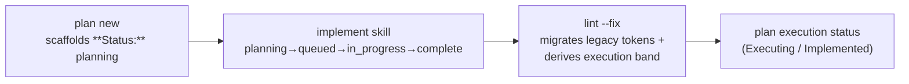

# Feature: Unify Task Status Vocabulary

> [SpecScore.**Studio**](https://specscore.studio): | [Explore](https://specscore.studio/app/github.com/specscore/specscore/spec/features/unify-task-status-vocabulary?op=explore) | [Edit](https://specscore.studio/app/github.com/specscore/specscore/spec/features/unify-task-status-vocabulary?op=edit) | [Ask question](https://specscore.studio/app/github.com/specscore/specscore/spec/features/unify-task-status-vocabulary?op=ask) | [Request change](https://specscore.studio/app/github.com/specscore/specscore/spec/features/unify-task-status-vocabulary?op=request-change) |
**Status:** Approved
**Source Ideas:** unify-task-status-vocabulary

## Summary

The 7-value Task status enum — `planning`, `queued`, `in_progress`, `blocked`, `complete`, `failed`, `aborted` — is the **single canonical task-status vocabulary** across every surface: the [Task entity](../task/task.entity.md), plan-inline `### Task N:` blocks, the `specscore plan new` scaffold, the plan execution-band rollup, the `task change-status` verb, and the implement skill. This Feature retires the divergent `pending`/`in-progress`/`done`/`blocked` token set that the scaffold and implement skill use today, defines the canonical lifecycle the implement skill follows, and makes `specscore spec lint --fix` auto-migrate legacy tokens.

## Problem

SpecScore has two divergent task-status vocabularies, and they silently disagree. The **canonical** 7-value enum is defined by the [Task entity](../task/task.entity.md) (and enumerated by the [status-vocabulary](../status-vocabulary/README.md) Feature as the execution-layer Task set it leaves to the Task Feature to own), and the plan execution-band rollup reads it ([plan#req:status-rollup](../plan/README.md#req-status-rollup): a task `in_progress` → plan `Executing`; all tasks `complete` → plan `Implemented`). But the `specscore plan new` scaffold and the specstudio `implement` skill instead write a **4-token** set — `pending`, `in-progress`, `done`, `blocked` — onto plan-inline task blocks.

So `done` ≠ `complete`: a plan whose tasks the implement skill marked `done` never rolls up to `Implemented`, because the rollup is looking for `complete`. The misalignment is silent and pre-exists any single feature. It also blocks the plan-inline path of [cli/task/change-status](https://github.com/specscore/specscore-cli/blob/main/spec/features/cli/task/change-status/README.md): a `task change-status` verb operating on the canonical enum cannot coherently target plan-inline blocks that carry non-enum tokens.

## Behavior

### Single canonical vocabulary

#### REQ: enum-is-sole-task-vocabulary

Task status MUST be one of the seven [Task entity](../task/task.entity.md) values — `planning`, `queued`, `in_progress`, `blocked`, `complete`, `failed`, `aborted` — on **every** surface that reads or writes a task's status, including plan-inline `### Task N:` blocks. The `pending`/`in-progress`/`done`/`blocked` token set is NOT a valid task-status vocabulary; `pending`, `in-progress` (hyphenated), and `done` are legacy values with canonical replacements (`planning`, `in_progress`, `complete`). No surface MAY introduce a parallel task-status token set.

### Plan-inline task status and the scaffold

#### REQ: plan-inline-status-is-enum

A plan-inline `### Task N:` block's `**Status:**` field MUST hold a canonical enum value. `specscore plan new` MUST scaffold each task block with `**Status:** planning` (the Task entity's initial state, per the entity's `task new`-creates-`planning` convention), NOT `pending`.

### Legacy-token migration

#### REQ: lint-fix-migrates-legacy-tokens

`specscore spec lint --fix` MUST rewrite legacy plan-inline task-status tokens to their canonical equivalents: `pending` → `planning`, `done` → `complete`, `in-progress` → `in_progress` (`blocked` is already canonical). The rewrite is value-for-value within the task block's `**Status:**` field and changes no other content.

#### REQ: lint-flags-legacy-tokens

Plain `specscore spec lint` (without `--fix`) MUST report a violation for any plan-inline task-status field carrying a legacy token, naming the offending token and its canonical replacement. It MUST also report a violation for any task-status token that is **neither** a canonical enum value **nor** a known legacy token (e.g. `shipped`), stating it is not a valid task status with no canonical mapping. This is the non-`--fix` counterpart that makes the vocabulary enforceable and the migration discoverable rather than silent.

### Implement-skill lifecycle alignment

#### REQ: implement-skill-canonical-lifecycle

The implement skill MUST write only canonical enum values when tracking plan-inline task progress, following this lifecycle: `planning` (authored, dependencies not yet satisfied) → `queued` (dependencies satisfied, not yet dispatched) → `in_progress` (subagent dispatched) → `complete` (task done); with `blocked`, `failed`, and `aborted` available for the corresponding outcomes. It MUST NOT write `pending`, `in-progress` (hyphenated), or `done`. (Realized in the specstudio `implement` skill — a consumer obligation of this canonical contract.)

### Rollup consistency

#### REQ: rollup-unaffected-and-canonical

The plan execution-band rollup ([plan#req:status-rollup](../plan/README.md#req-status-rollup)) reads canonical task-status values and is unchanged by this Feature: only `in_progress` contributes `Executing`, only an all-`complete` set yields `Implemented`, `blocked`/`failed` map per the existing precedence, and `planning`/`queued` are pre-execution (they do not trigger `Executing`). After migration, a previously-`done` task reads `complete` and therefore rolls up to `Implemented` as intended.

## Architecture & components

- **[Task entity](../task/task.entity.md)** — the canonical source of the seven status values. Unchanged; this Feature anchors it as authoritative.
- **`specscore plan new` scaffold** (specscore-cli) — emits `**Status:** planning` per [plan-inline-status-is-enum](#req-plan-inline-status-is-enum).
- **`specscore spec lint` / `--fix`** (specscore-cli) — flags legacy tokens (plain) and auto-migrates them (`--fix`), per the migration REQs.
- **Plan execution-band rollup** (specscore-cli `lint --fix`) — already enum-based; confirmed unaffected.
- **`cli/task/change-status` verb** (specscore-cli) — already operates on the enum; this Feature unblocks its plan-inline path.
- **specstudio `implement` skill** — adopts the canonical lifecycle ([implement-skill-canonical-lifecycle](#req-implement-skill-canonical-lifecycle)); the cross-repo consumer of this contract.

## Data flow

## Error handling & failure modes

| Failure | Surface | Outcome |
|---|---|---|
| Plan-inline task carries a legacy token (`pending`/`done`/`in-progress`) | `specscore spec lint` | Violation naming the token and its canonical replacement ([lint-flags-legacy-tokens](#req-lint-flags-legacy-tokens)). |
| Same, under `--fix` | `specscore spec lint --fix` | Auto-rewritten to canonical; no violation ([lint-fix-migrates-legacy-tokens](#req-lint-fix-migrates-legacy-tokens)). |
| Plan-inline task carries a token outside both the enum and the legacy set (e.g. `shipped`) | `specscore spec lint` | Violation: not a valid task status, no canonical mapping. |

## Testing strategy

The scaffold output, the lint flag, and the `--fix` migration are CLI-testable and SHOULD carry Rehearse stubs in `specscore-cli`. The implement-skill lifecycle ([implement-skill-canonical-lifecycle](#req-implement-skill-canonical-lifecycle)) is a behavior of the specstudio `implement` skill, observable only in that consumer; it is verified there, not by this repo's Rehearse — see [Rehearse Integration](#rehearse-integration).

## Rehearse Integration

This Feature is a canon/contract spec in the methodology repo; its enforceable surfaces (scaffold, lint flag, `--fix` migration, rollup) are implemented and tested in `specscore-cli`, and the lifecycle obligation is implemented and tested in the specstudio `implement` skill. No Rehearse stubs are scaffolded in this repo; the consuming repos own the executable tests against these ACs.

## Not Doing / Out of Scope

Inherited from the [source Idea](../../ideas/unify-task-status-vocabulary.md), plus spec-level cuts:

- Changing the 7-value enum itself — it is already canonical; this Feature adopts and anchors it.
- Adding task states beyond the seven — the gap is alignment, not expressiveness.
- Touching the Issue status vocabulary — a separate execution-layer set, out of scope.
- A separate plan-task progress field distinct from execution status (the two-axes option) — rejected in the Idea.
- Backfilling provenance or any other task field during migration — the migration rewrites only the `**Status:**` token.

## Assumption carryover

From the [source Idea](../../ideas/unify-task-status-vocabulary.md):

- **Resolved (was Must-be-true): the enum expresses all plan-task progress.** Encoded as the explicit lifecycle in [implement-skill-canonical-lifecycle](#req-implement-skill-canonical-lifecycle) (`planning`/`queued`/`in_progress`/`complete` + `blocked`/`failed`/`aborted`), with `queued` adopted as a distinct state.
- **Carried (Must-be-true): the specstudio `implement` skill source is editable.** Validated at implement time when the skill's status-write logic is changed; if the source is not reachable end-to-end, the lifecycle REQ becomes a documented-but-unrealized consumer obligation.
- **Resolved (was Should-be-true): migration is mechanical and safe.** Encoded as the `lint --fix` value-for-value rewrite ([lint-fix-migrates-legacy-tokens](#req-lint-fix-migrates-legacy-tokens)).
- **Carried (Should-be-true): no consumer depends on the literal legacy tokens.** Validate during implementation by grepping specscore-cli and specstudio for `"pending"`/`"done"` status-string literals.

## Interaction with Other Features

| Feature | Interaction |
|---|---|
| [task](../task/README.md) | Owns the canonical 7-value enum this Feature anchors as the single vocabulary. |
| [plan](../plan/README.md) | Plan-inline task `**Status:**` now explicitly uses the enum; the rollup is confirmed canonical and unaffected. |
| [status-vocabulary](../status-vocabulary/README.md) | Already enumerates the Task set as the execution-layer vocabulary; this Feature makes it the sole task-status source in practice. |
| [cli/task/change-status](https://github.com/specscore/specscore-cli/blob/main/spec/features/cli/task/change-status/README.md) | Unblocked: its plan-inline path can target enum-valued task blocks once migration lands. |

## Acceptance Criteria

### AC: enum-is-sole-vocabulary

**Requirements:** unify-task-status-vocabulary#req:enum-is-sole-task-vocabulary, unify-task-status-vocabulary#req:lint-flags-legacy-tokens

Scenario: A plan-inline task status outside the enum is rejected
Given a plan-inline `### Task N:` block whose `**Status:**` is `shipped` (neither an enum value nor a known legacy token)
When `specscore spec lint` runs
Then a violation is reported stating the value is not a valid task status, with no canonical mapping offered.

### AC: scaffold-emits-planning

**Requirements:** unify-task-status-vocabulary#req:plan-inline-status-is-enum

Scenario: plan new scaffolds the canonical initial status
Given a user runs `specscore plan new <slug> --feature <f>`
When the scaffold writes the task blocks
Then each `### Task N:` block carries `**Status:** planning` and no block carries `**Status:** pending`.

### AC: lint-fix-migrates-legacy

**Requirements:** unify-task-status-vocabulary#req:lint-fix-migrates-legacy-tokens

Scenario: lint --fix rewrites legacy tokens to canonical
Given a plan-inline task block carrying `**Status:** done` (and another carrying `**Status:** pending`)
When `specscore spec lint --fix` runs
Then the `done` field becomes `complete` and the `pending` field becomes `planning`, with no other content changed.

### AC: lint-flags-legacy

**Requirements:** unify-task-status-vocabulary#req:lint-flags-legacy-tokens

Scenario: plain lint surfaces legacy tokens with their replacement
Given a plan-inline task block carrying `**Status:** pending`
When `specscore spec lint` runs (without `--fix`)
Then a violation is reported naming `pending` and its canonical replacement `planning`.

### AC: implement-skill-lifecycle

**Requirements:** unify-task-status-vocabulary#req:implement-skill-canonical-lifecycle

Scenario: the implement skill writes only canonical values
Given the implement skill advances a plan-inline task from authored through completion
When it writes the task's `**Status:**` at each step
Then the written values are drawn only from `planning`/`queued`/`in_progress`/`complete` (and `blocked`/`failed`/`aborted`), and never `pending`/`in-progress`/`done`.

### AC: rollup-reaches-implemented

**Requirements:** unify-task-status-vocabulary#req:rollup-unaffected-and-canonical

Scenario: an all-complete plan rolls up to Implemented after migration
Given a plan whose tasks were legacy `done` and have been migrated to `complete`
When `specscore spec lint --fix` derives the plan execution band
Then the plan's status rolls up to `Implemented` (which the legacy `done` token never triggered).

## Open Questions

- Should the legacy-token `lint --fix` migration be permanent, or removed after a deprecation window once no plan in the corpus carries legacy tokens? (Deferred — keep it indefinitely for safety in the MVP.)

---
*This document follows the https://specscore.md/feature-specification*
