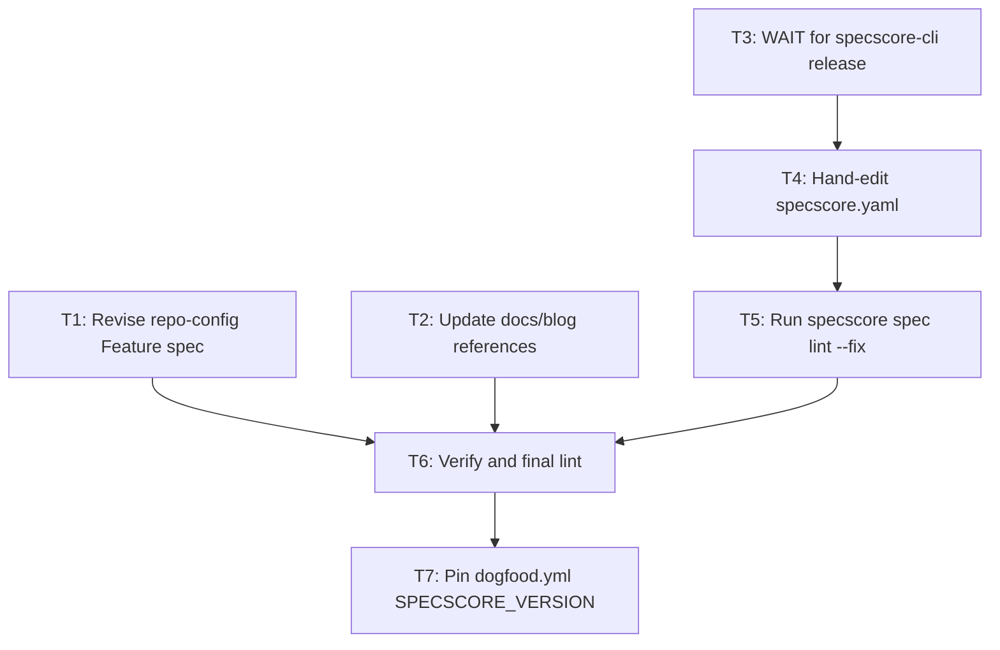

# Plan: Studio Toolbar — Spec Migration

**Status:** draft
**Features:**
  - [studio-toolbar](../../features/studio-toolbar/README.md)
  - [repo-config](../../features/repo-config/README.md)
**Source type:** feature
**Source:** [studio-toolbar](../../features/studio-toolbar/README.md)
**Author:** alexander.trakhimenok
**Created:** 2026-05-19
**Effort:** S
**Impact:** high

## Context

The [studio-toolbar Feature](../../features/studio-toolbar/README.md) is `Approved`. It specifies a four-item toolbar replacing the legacy `> [View in SpecStudio](url) — graph, discussions, approvals` line at file position 3 of every feature README, renames the `viewer:` yaml block to `studio:`, and migrates the default URL from `https://specstudio.synchestra.io/` to `https://specscore.studio/` with a new path-style grammar `{studio.url}/app/p/{host}/{org}/{repo}/{artifact_path}?op={verb}`. The Feature is pre-v1; the rename is a hard break with no backward compatibility.

This plan covers the spec-repo side of the migration: revising the [repo-config Feature](../../features/repo-config/README.md) to own the `studio:` block schema (it currently owns `viewer:`), updating SpecScore documentation references, hand-editing `specscore.yaml`, and running the new `--fix` autofix against every feature README in this repo to migrate the toolbar lines. The CLI implementation lives in a sibling plan in [`specscore-cli`](https://github.com/specscore/specscore-cli/blob/main/spec/plans/studio-toolbar/README.md); per [AGENTS.md](../../../AGENTS.md), no CLI code lives here.

Tasks split into two phases:

- **Phase 1 (no CLI dependency)** — revise `repo-config` Feature spec; update `docs/` and `blog/` references. These are pure markdown edits and can land immediately.
- **Phase 2 (gated on CLI release)** — hand-edit `specscore.yaml`, then run `specscore spec lint --fix` against the spec tree to migrate every feature README's toolbar line. Requires the `specscore-cli` plan to have shipped a release containing the new `studio-toolbar` lint rule and its `--fix` autofix.

The studio web app at `specscore.studio/app/p/` must accept `?op=explore|edit|ask|request-change` before this plan completes. Studio readiness is a precondition tracked by the Feature's Must-be-true assumption.

## Acceptance criteria

- The [repo-config Feature](../../features/repo-config/README.md) defines a `studio:` block (with `name` and `url` fields, defaults `name = "SpecScore.Studio"` and `url = "https://specscore.studio/"`) and contains REQs `studio-default-when-omitted`, `studio-explicit-values`, `studio-null-opts-out`, and `studio-url-trailing-slash`. The legacy `viewer:` section, its four REQs (`viewer-*`), its example, and its AC (`viewer-rules`) are removed. The `repo-config` Feature's Outstanding Question about `viewer.name` differing from `viewer.url` host is either re-scoped to `studio.*` or removed.
- The `repo-config` Feature's Interaction-with-Other-Features table replaces the `Feature` row's mention of "View in …" links with a reference to the new `studio-toolbar` toolbar.
- `specscore.yaml` at the repository root uses `studio:` (not `viewer:`); explicit values match the new defaults (or are omitted to inherit defaults). The schema-pointer comment on line 1 is unchanged.
- Every feature README under `spec/features/*/README.md` has the canonical toolbar line at file position 3, byte-exact against the resolved `studio` config per the `studio-toolbar` lint rule. No README still carries the legacy `> [View in SpecStudio](...)` line.
- `specscore spec lint` (with the CLI release that ships `studio-toolbar`) returns `0 violations found` against the spec tree.
- The site build (`pnpm build` in `tools/site-generator/`) succeeds with no broken links or references to the removed `viewer:` keyword. References to "View in SpecStudio" in docs/blog narrative copy that survived the migration are intentional historical context, not active configuration documentation.
- `dogfood.yml` (the GitHub Actions workflow that installs the released CLI and lints `spec/`) passes against `SPECSCORE_VERSION` pinned to the release containing `studio-toolbar`.

## Dependency graph



T1 and T2 are independent and can run in parallel without waiting for CLI. T3 is a passive wait (the sibling [specscore-cli plan](https://github.com/specscore/specscore-cli/blob/main/spec/plans/studio-toolbar/README.md) drives it). T4 → T5 → T6 → T7 are strictly sequential after T3 completes.

## Tasks

### 1. Revise the `repo-config` Feature spec

Edit `spec/features/repo-config/README.md` to remove the `viewer:` ownership and introduce `studio:`:

- **Summary:** swap "viewer configuration" for "studio configuration" in the one-line description.
- **Problem:** update the paragraph that mentions `viewer:` and "View in …" hardcoding to instead describe the studio toolbar with the four canonical verbs and the legacy `viewer:` block as out-of-date.
- **`### Viewer` section:** rename to `### Studio` and rewrite. The fields table becomes `name` and `url` for the `studio:` block. The narrative refers to "the studio toolbar rendered in artifact documents (e.g., feature READMEs)" instead of "View in …" links.
- **REQs:** rename `viewer-default-when-omitted` → `studio-default-when-omitted` (defaults: `name: SpecScore.Studio`, `url: https://specscore.studio/`); `viewer-explicit-values` → `studio-explicit-values` (same partial-mapping-is-error semantics); `viewer-null-opts-out` → `studio-null-opts-out` (semantics unchanged: studio: null suppresses the toolbar); `viewer-link-mandatory-unless-opted-out` → `studio-toolbar-mandatory-unless-opted-out` (now defers to the `studio-toolbar` Feature's lint rule for the actual toolbar shape). Add a NEW REQ `studio-url-trailing-slash` requiring `studio.url` to end with exactly one trailing `/` (a hard error otherwise), since the studio-toolbar Feature's `url-grammar-trailing-slash` REQ explicitly defers the schema-level validation here.
- **Example block (around line 268):** swap `viewer: { name: SpecStudio, url: https://specstudio.synchestra.io/ }` for `studio: { name: SpecScore.Studio, url: https://specscore.studio/ }`.
- **AC: viewer-rules:** rename to `AC: studio-rules` with the four renamed REQs cited; update the `Given / When / Then` text to use `studio:` and `studio: null`.
- **Interaction-with-Other-Features table:** the `Feature` row's interaction reference to "View in …" links becomes a reference to the studio toolbar (and cites the new `studio-toolbar` Feature instead of the rendering convention).
- **Outstanding Questions:** the question about `viewer.name` differing from `viewer.url` host (around line 354) is re-scoped to `studio.name` differing from `studio.url` host — answer remains "spec currently allows it freely". Keep or remove at the author's discretion; either is fine.

After edits, run `specscore spec lint`. The current 0.17.0 CLI does not care about REQ slug names — it validates structural conventions only. Lint MUST stay at `0 violations found`. Stage and commit.

### 2. Update `docs/` and `blog/` references

Search `docs/` and `blog/` for references to:

- The literal string `viewer:` as a yaml-block keyword
- "View in SpecStudio" as a description of artifact navigation
- The host `specstudio.synchestra.io`
- The legacy `?id={repo}@{org}@{host}&path=...` URL form

Each surviving occurrence is one of: (a) active documentation that should be rewritten to describe the new `studio:` block and toolbar, (b) historical narrative (e.g., a blog post about the migration itself) which stays as-is and may add a "now superseded by …" pointer, or (c) a stale dead reference that can be deleted.

Run `pnpm build` in `tools/site-generator/` after edits; the build MUST succeed. Spot-check rendered output for broken links and stale screenshots. Stage and commit.

### 3. WAIT for `specscore-cli` release

The sibling plan in [specscore-cli](https://github.com/specscore/specscore-cli/blob/main/spec/plans/studio-toolbar/README.md) ships:

- The new `studio:` yaml parser (rejects `viewer:` with a clear migration error)
- The `studio-toolbar` lint rule (byte-exact validation per the Feature's `toolbar-line-shape` REQ)
- The `--fix` autofix that rewrites legacy lines and missing toolbars
- The removal of the `view-link` rule

Watch for the release tag. No work in this repo proceeds past this point until the release is published to the same channels (curl install, Homebrew tap, Scoop bucket, WinGet) the rest of the CLI uses.

### 4. Hand-edit `specscore.yaml`

Edit `specscore.yaml` at the repository root. The file currently contains:

```yaml
# SpecScore Repo Config Schema: https://specscore.md/repo-config

project:
  title: SpecScore

viewer:
  name: SpecStudio
  url: https://specstudio.synchestra.io/
```

Replace the `viewer:` block with the default `studio:` (or omit the block entirely to inherit defaults — both are equivalent per `studio-default-when-omitted`). The minimal post-migration form is:

```yaml
# SpecScore Repo Config Schema: https://specscore.md/repo-config

project:
  title: SpecScore
```

(Defaults: `name: SpecScore.Studio`, `url: https://specscore.studio/` — both inherited.)

Verify the schema-pointer comment on line 1 is unchanged. Verify with the new CLI build: `specscore spec lint` MUST emit `0 violations found` for the yaml file's structural shape. Stage and commit.

### 5. Run `specscore spec lint --fix`

With the new CLI installed and `specscore.yaml` migrated (T4), run:

```sh
specscore spec lint --fix
```

The `studio-toolbar` autofix rewrites every feature README's line at file position 3 from the legacy form to the canonical toolbar form, byte-exact against the resolved `studio` config. The autofix MUST NOT touch any other line of any README.

Inspect the diff carefully:

- Every `spec/features/*/README.md` should have exactly one modified line: file position 3.
- The new line should match the canonical form: `> [SpecScore.**Studio**](https://specscore.studio): | [Explore](.../?op=explore) | [Edit](.../?op=edit) | [Ask question](.../?op=ask) | [Request change](.../?op=request-change) |`.
- The URL host should be `specscore.studio` for every link.
- The path prefix should be `/app/p/github.com/specscore/specscore/spec/features/<slug>` (note: `host` is whatever the new CLI infers from the git remote — `github.com` for this repo).
- `?op={verb}` is present on every link.
- No double slash, no trailing slash drift, no UTM parameters, no `@branch`/`?ref=` suffix.

After visual review, run `specscore spec lint` once more — MUST be `0 violations found`. Stage and commit.

### 6. Verify and final lint

Run the dogfood pipeline locally:

```sh
specscore spec lint
pnpm test    # inside tools/site-generator/
pnpm build   # inside tools/site-generator/
```

All three MUST pass. The site build MUST render the new toolbar in every feature README's HTML output. Spot-check 3-5 features in a browser against the rendered specscore.md site to confirm the toolbar looks correct: clickable brand, four toolbar items with the right labels and URLs, single line in a blockquote at the top.

### 7. Pin `dogfood.yml` `SPECSCORE_VERSION`

Edit `.github/workflows/dogfood.yml` to bump `SPECSCORE_VERSION` to the release tag from T3. Confirm the workflow file's install command still uses `https://specscore.md/install/get-cli` per AGENTS.md. Push a test branch, watch the workflow run, confirm it passes.

Once green on `main`, this plan is complete.

## Outstanding Questions

- The `studio-toolbar` Feature's `Might-be-true` assumption — does the `|` separator survive all common markdown renderers? — is best validated during T6 spot-check. If a renderer (GitHub mobile, narrow editor preview) mangles the toolbar visibly, file a follow-up Idea about an alternative separator and defer this plan's completion until resolved. Treat the assumption as still-open until T6 closes it.
- The studio web app's readiness for `?op=ask` and `?op=request-change` is tracked outside both plans. If those endpoints are not live by T7, the toolbar will render but two of its links return 404. The plan still completes; the studio side catches up post-merge.

---
*This document follows the https://specscore.md/plan-specification*
